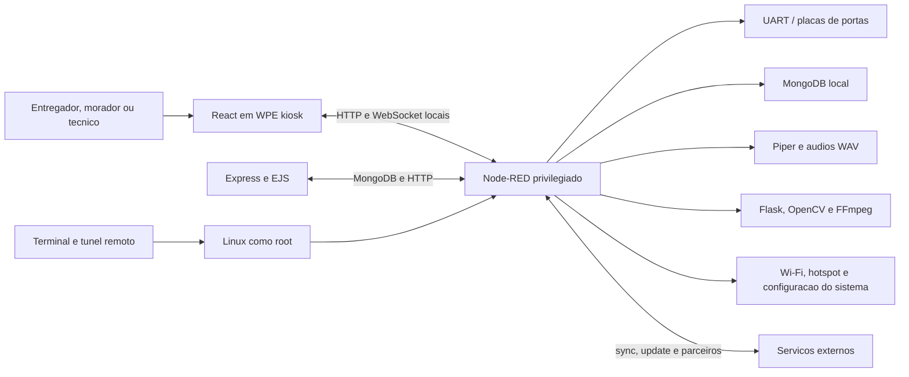

# Analise comparativa do app de locker recuperado

## Objetivo e limites

Este documento registra a analise estatica do material encontrado na pasta
local `Analise de pendrive`. O conjunto aparenta pertencer a uma solucao de
smart locker identificada no codigo como VExpress. O objetivo e aprender com a
arquitetura, os fluxos e as decisoes operacionais observadas, sem incorporar
codigo, credenciais, dados pessoais ou ativos proprietarios ao PREDDITA Locker.

O material bruto permanece fora do repositorio. Nenhum servico original foi
iniciado, nenhuma imagem foi instalada e nenhuma chamada foi feita para
servidores, cameras, placas ou dispositivos externos.

As conclusoes usam tres niveis:

- **Confirmado:** observado diretamente em codigo, configuracao ou inventario.
- **Inferencia:** explicacao provavel, mas sem prova suficiente no material.
- **Nao determinado:** depende do banco original, do hardware ou de execucao
  controlada que nao foi realizada.

Credenciais, tokens, senhas, dominios privados, enderecos de rede e dados de
usuarios encontrados durante a analise foram deliberadamente omitidos.

## Resumo executivo

O app analisado e uma solucao Linux ARM64 para Rock Pi, e nao um aplicativo
Android. A interface React roda em modo kiosk; o Node-RED coordena portas,
serial, banco, rede, audio, cameras, sincronizacao, atualizacao e manutencao;
MongoDB guarda configuracao e operacao; servicos auxiliares cuidam de camera,
voz, proxy e acesso remoto.

O produto tem amplitude funcional relevante. Ele oferece orientacao por voz,
fluxos especificos para entregadores, varios tamanhos e blocos, camera de
evidencia, diagnostico de campo, configuracao de tela e rede, integracoes e um
protocolo serial com boas rotinas de recuperacao.

O maior problema e arquitetural: componentes privilegiados concentram muitas
responsabilidades e confiam em segredos estaticos. Foram confirmados riscos
criticos de execucao remota como `root`, atualizacao sem verificacao
criptografica, credenciais em texto puro e endpoints de camera com controles
insuficientes. Quase nao ha testes automatizados e nao foi encontrada politica
automatica de retencao para historicos, fotos ou videos.

A PREDDITA esta mais madura nas fundacoes de seguranca e confiabilidade:
autenticacao HMAC com nonce, Android Keystore, sessoes e papeis, MFA, CSRF,
Postgres transacional, idempotencia, prova fisica fechada-aberta-fechada,
separacao Edge/Kiosk, update validado, privacidade e CI. O material analisado e
mais util como fonte de ideias de produto e operacao do que como referencia de
implementacao.

## Inventario observado

O conjunto analisado possui aproximadamente 374 MB, 3.037 arquivos e 704
diretorios. Ele inclui imagens recuperadas de dois sistemas Linux, codigo,
configuracoes, inventarios sanitizados e uma versao de demonstracao offline.

Componentes principais confirmados:

| Componente | Tecnologia | Papel observado |
| --- | --- | --- |
| Tela principal | React 18, React Router, Redux Toolkit | Fluxos de entrega, retirada e suporte |
| Kiosk alternativo | React 18 | Outra geracao da interface publica |
| Backend | Node.js, Express, EJS, Mongoose | Login, moradores, historico, portas, videos e codigos |
| Orquestrador principal | Node-RED e MongoDB | Regras, serial, telas, audio, WhatsApp e configuracao |
| Orquestrador auxiliar | Node-RED, PostgreSQL e scripts | Serial mais novo, sync, update, camera, rede e failsafe |
| Camera | Flask, OpenCV e FFmpeg | Stream, gravacao, snapshot e publicacao de videos |
| Voz | Piper e arquivos WAV | TTS e instrucoes sonoras por etapa |
| Proxy | Traefik | Exposicao de camera, videos e Node-RED |
| Operacao remota | PM2, FRP e Socket.IO | Inicializacao e manutencao remota |

O orquestrador principal possui 2.362 nos em 17 abas e 30 entradas HTTP. O
auxiliar possui 2.763 nos em 24 abas e 46 entradas HTTP. Essa escala confirma
que o Node-RED funciona como o nucleo do produto, nao apenas como adaptador de
hardware.

As duas imagens usam distribuicoes e hostnames semelhantes, mas versoes e
responsabilidades diferentes. A hipotese mais provavel e que representem duas
geracoes ou unidades complementares. Nao ha prova de que operavam juntas.

## Arquitetura reconstruida

Portas observadas no host incluem React, backend, Node-RED, MongoDB, camera e
Traefik. Grande parte da comunicacao local usa HTTP ou WebSocket sem TLS e
enderecos fixos. O proxy oferece HTTP e HTTPS para alguns servicos, mas o
controle de acesso nao e uniforme.

O sistema inicia seus processos com PM2 e systemd. Node-RED, camera, terminal
remoto e tunel podem iniciar automaticamente. Node-RED e scripts de manutencao
operam como `root`, ampliando o impacto de qualquer falha em fluxo, endpoint ou
dependencia.

## Fluxos de produto

### Entrega

O fluxo principal observado segue esta sequencia:

1. Escolher tamanho `P`, `M`, `G` ou extra grande conforme disponibilidade.
2. Selecionar bloco quando o empreendimento possui mais de um.
3. Informar apartamento em teclado numerico.
4. Confirmar tamanho e unidade.
5. Aguardar a porta abrir, depositar e fechar.
6. Confirmar a entrega e, para entregadores autenticados, iniciar outra sem
   retornar ao inicio.

Uma interface alternativa separa Correios de outros entregadores. O login dos
Correios usa matricula e senha digitadas em teclado virtual. A ideia de sessao
para varias entregas reduz atrito operacional, mas a implementacao observada
guarda credenciais no `localStorage`, o que nao deve ser reproduzido.

### Retirada

O morador informa um codigo numerico, o sistema escolhe a entrega, abre a porta
e orienta a retirada e o fechamento. Tambem existem codigos temporarios e
fixos, com limite funcional de quantidade no painel recuperado.

Os codigos de seis digitos sao gerados com `Math.random` e convertidos para
numero. Isso nao e adequado para credenciais: a fonte nao e criptograficamente
segura e zeros iniciais podem ser perdidos.

### Voz e acessibilidade

Rotas e acoes acionam audios para boas-vindas, escolha de tamanho, abertura,
fechamento, sucesso, cancelamento e erro. A versao mais nova tambem oferece TTS
por Piper, volume e brilho configuraveis.

Esta e uma boa direcao de produto para ambiente publico, desde que haja opcao
de silenciar, limites de volume, textos equivalentes na tela e nenhum dado
pessoal falado em area comum.

### Camera e evidencia

O sistema aceita cameras USB e IP, stream MJPEG, snapshots e gravacao de video.
O servico reconecta cameras, controla FPS e converte gravacoes para H.264.

O conceito pode apoiar comprovacao de deposito e diagnostico, mas o material
nao demonstra consentimento, minimizacao, criptografia, autorizacao granular ou
retencao automatica. O servico permite que algumas rotas escolham caminhos de
saida no sistema de arquivos e ha rotas de gravacao, snapshot e videos sem
protecao suficiente. Isso transforma uma funcionalidade util em risco critico
de seguranca e privacidade.

### Operacao tecnica

Foram encontradas funcoes para:

- brilho, volume, resolucao e status da tela;
- busca, conexao e desconexao Wi-Fi;
- hotspot de manutencao;
- lista e teste de cameras;
- verificacao de todas as portas;
- bloqueio, reset e abertura de porta;
- reinicio e retorno da tela ao inicio;
- versao, historico e status de atualizacao;
- sincronizacao de entregas, parceiros e pre-entregas;
- diagnostico serial e modo failsafe.

A cobertura e valiosa para suporte de campo. O risco vem de expor esses
controles no mesmo processo privilegiado e com autorizacao distribuida.

## Dados e persistencia

Colecoes confirmadas entre as duas geracoes:

| Area | Dados observados |
| --- | --- |
| Usuarios | login, papel, apartamento, senha e moradores associados |
| Configuracao | condominio, locker, cidade, apartamentos, blocos e kiosk |
| Portas | numero, tamanho, disponibilidade, estado, tentativas e erros |
| Entregas | apartamento, porta, codigo, datas, modo e contato |
| Historicos | eventos de entrega e retirada |
| Acesso | codigos fixos ou temporarios e expiracao |
| Camera | nomes, caminhos, metadados, miniaturas e arquivos |
| Integracao | comandos, sincronizacoes, parceiros e usuarios de app |

O banco local favorece operacao sem internet. Sincronizacoes externas parecem
complementar a execucao local, o que e coerente com um produto local-first.

Problemas confirmados ou sem evidencia de controle:

- senhas de usuario armazenadas e consultadas em texto puro;
- credenciais e tokens estaticos em codigo e configuracao;
- ausencia de escopo forte por tenant e locker no backend observado;
- objetos completos de usuario colocados em sessao e enviados a views;
- exclusoes manuais pontuais, sem TTL ou expurgo automatico de historicos,
  fotos e videos;
- dados pessoais e evidencias operacionais recuperados nos discos;
- logs de processo volumosos, sem estrutura, correlacao ou sanitizacao
  sistematica demonstrada.

## Hardware e protocolo serial

O material indica placas e respostas de pelo menos tres variantes:

- V1 com resposta de nove bytes;
- V1P com resposta de cinco bytes;
- V2 com resposta de seis bytes.

Na geracao principal, parte dos comandos hexadecimais por porta fica no
MongoDB. Portanto, o protocolo completo nao pode ser reconstruido apenas pelo
codigo recuperado.

A geracao auxiliar possui mecanismos interessantes de resiliencia:

- exclusao mutua no barramento serial;
- configuracao de porta e baud rate;
- dupla leitura de estado;
- timeout total e entre bytes;
- repeticao limitada;
- fechamento e reabertura do driver uma unica vez;
- classificacao de porta aberta, fechada ou travada;
- erros distintos para timeout, frame incompleto e falha de dispositivo.

Essas ideias merecem avaliacao na PREDDITA, mas devem ser reimplementadas sobre
o parser validado, o comissionamento e a prova fechada-aberta-fechada atuais.
Retry nunca pode transformar estado fisico incerto em sucesso nem repetir uma
abertura sem idempotencia.

## Atualizacao e recuperacao

O atualizador analisado possui boas praticas operacionais:

- lock para impedir duas atualizacoes simultaneas;
- backup antes da troca;
- retencao limitada de backups e logs;
- rollback;
- watchdog e timeout;
- arquivo de versao;
- verificacoes de arquivo, diretorio, processo e HTTP apos a instalacao.

Entretanto, o pacote e o plano remoto nao possuem verificacao criptografica
demonstrada. O plano aceita comandos arbitrarios como `root`, e nao foi
encontrada validacao robusta de hash, assinatura ou caminhos do arquivo
compactado. O comprometimento da origem de update equivaleria ao
comprometimento total do locker.

A PREDDITA ja valida HTTPS e redirecionamentos, tamanho, SHA-256, pacote,
`versionCode`, certificado, estado ocioso e bloqueio de downgrade. As ideias de
backup, watchdog e verificacao de saude podem complementar essa base, sem
adotar o plano remoto executavel.

## Seguranca

### Achados criticos

1. **Terminal remoto como root.** Um processo iniciado pelo PM2 recebe comandos
   por Socket.IO e executa `bash` como `root`. A autenticacao depende de
   segredos estaticos. O recurso representa execucao remota total por projeto.
2. **Cadeia de update privilegiada.** Pacote e plano remoto podem modificar o
   sistema e executar comandos como `root` sem assinatura ou hash obrigatorio.
3. **Segredos e senhas estaticos.** Foram encontrados segredos em backend,
   fluxos e scripts, alem de senha de morador em texto puro.
4. **Camera com escrita e leitura insuficientemente protegidas.** Rotas aceitam
   caminho de arquivo fornecido pelo chamador e publicam evidencias sem uma
   fronteira consistente de autorizacao.

### Achados altos

- Node-RED opera como `root`, com editor ativo e muitos nos `exec`.
- Nao ha autenticacao HTTP global no Node-RED nem obrigatoriedade global de
  HTTPS.
- A autorizacao por rota depende de switches e funcoes espalhados pelos fluxos.
- Sessao Express usa segredo estatico, armazenamento em memoria e configuracao
  de cookie insuficiente.
- Nao foram encontrados CSRF, Helmet, rate limit ou validacao central robusta.
- Comunicacoes HTTP e WebSocket locais usam cleartext.
- Servico Flask escuta em todas as interfaces com modo de debug habilitado.
- Nao ha politica demonstrada de retencao e eliminacao de dados pessoais.

### Cobertura aparente das rotas Node-RED

Uma busca estatica pelos sete primeiros saltos de cada fluxo encontrou
evidencia de verificacao de token ou autorizacao em:

- 21 de 30 entradas HTTP no orquestrador principal;
- 45 de 46 entradas HTTP no orquestrador auxiliar.

Isso nao prova seguranca: a verificacao pode ser incompleta, usar segredo
estatico ou ocorrer depois de algum efeito. Tambem nao substitui autenticacao
global. O resultado apenas evita classificar todas as rotas como publicas sem
evidencia.

### Achados medios

- codigos de acesso gerados com fonte aleatoria inadequada;
- credencial de entregador persistida no navegador;
- WebSockets com endereco fixo e sem reconexao robusta;
- navegacao por reload completo em varias telas;
- regras de autorizacao repetidas controlador por controlador;
- dependencias e runtimes de geracoes diferentes;
- praticamente nenhum teste automatizado de regra, API, hardware ou jornada;
- logs PM2 extensos sem observabilidade estruturada.

## Comparacao com a PREDDITA

| Area | App analisado | PREDDITA atual | Direcao |
| --- | --- | --- | --- |
| Plataforma edge | Linux ARM64 e Node-RED | Android e Edge Agent | Manter separacao PREDDITA |
| Operacao offline | Banco e regras locais | Diario local idempotente | PREDDITA mais segura |
| Prova de porta | Estados e retries seriais | Ciclo fechado-aberto-fechado | Manter contrato PREDDITA |
| Autenticacao do device | Tokens estaticos | HMAC, nonce e Keystore | PREDDITA mais segura |
| Admin | Express/EJS com sessao fraca | Sessao persistente, CSRF, papeis e MFA | PREDDITA mais segura |
| Persistencia cloud | MongoDB e fluxos | Postgres normalizado e transacional | PREDDITA mais robusta |
| Atualizacao | Backup e rollback, sem assinatura | APK validado e rollout controlado | Adicionar health checks seguros |
| Observabilidade | Debug e PM2 logs | JSONL/Postgres correlacionado | PREDDITA mais madura |
| Privacidade | Sem retencao automatica observada | Expurgo, anonimizacao e titular | PREDDITA mais madura |
| Testes | Quase ausentes | Contratos, E2E, smokes e CI | PREDDITA mais madura |
| Voz | WAV e TTS local | Nao implementado | Oportunidade PREDDITA |
| Entregador | Correios e sessao de varias entregas | Fluxo geral e nova entrega | Avaliar identidade por parceiro |
| Tamanhos e blocos | P, M, G, extra G e blocos | P, M e G por comissionamento | Avaliar por demanda real |
| Camera | Stream, foto e video | Foto de etiqueta e QR | Video apenas com justificativa LGPD |
| Suporte local | Tela, rede, camera e failsafe | Comissionamento e diagnostico | Expandir console tecnico |
| Integracoes | Sync, parceiro, WhatsApp e pre-entrega | SMTP, API, MQTT e Admin | Criar contratos por prioridade |

## O que vale aproveitar como conceito

1. **Orientacao sonora opcional.** Audios curtos por etapa e TTS local podem
   melhorar acessibilidade e reduzir erro em ambiente publico.
2. **Console tecnico do locker.** Brilho, volume, rede, versao, cameras, teste
   de portas e health checks em uma area autenticada ajudam suporte de campo.
3. **Resiliencia do driver serial.** Mutex de barramento, retries limitados,
   reabertura unica e telemetria de erro podem complementar o Edge Agent.
4. **Health checks de atualizacao.** Verificar processo, UI e contrato local
   depois da instalacao e prever recuperacao controlada.
5. **Identidade de transportadora.** Parceiros de alto volume podem usar
   autenticacao propria e uma sessao curta para varias entregas, sem armazenar
   senha no kiosk.
6. **Blocos e tamanho extra grande.** Adotar somente quando os pilotos
   demonstrarem necessidade, mantendo mapa fisico comissionado.
7. **Pre-entregas e API de parceiro.** Criar contrato idempotente, autenticado e
   auditado para antecipar dados de volumes.
8. **Diagnostico de camera.** Exibir disponibilidade e teste local sem publicar
   stream ou gravacao por padrao.

## O que nao deve ser incorporado

- codigo ou assets proprietarios do material recuperado;
- segredos estaticos no codigo, URL, navegador ou fluxo;
- terminal remoto generico e permanente como `root`;
- Node-RED exposto como nucleo privilegiado da aplicacao;
- plano de update remoto capaz de executar shell arbitrario;
- senha em texto puro ou no `localStorage`;
- endpoints de camera sem autenticacao, escopo, auditoria e retencao;
- confirmacao de porta baseada apenas no comando enviado ou em leitura
  ambigua;
- retries fisicos sem idempotencia e reconciliacao de estado;
- HTTP ou WebSocket cleartext fora de loopback controlado.

## Backlog recomendado

### Prioridade 1 - proximo ciclo de produto

1. Especificar orientacao sonora acessivel, com audio local, opcao de silencio,
   volume maximo e textos equivalentes. Nao falar unidade, nome, PIN ou codigo.
2. Ampliar o diagnostico tecnico com estado de rede, camera, tela, armazenamento
   e versao, protegido pelo papel `suporte` ou `super_admin` e com auditoria.
3. Projetar melhorias do driver serial: fila exclusiva por barramento, retry
   limitado, reabertura unica e metricas por tipo de erro. Preservar
   idempotencia e prova fisica.
4. Adicionar health check pos-update e uma estrategia de recuperacao que nao
   aceite scripts remotos nem enfraqueca assinatura, hash ou certificado.

### Prioridade 2 - validar com pilotos

5. Medir necessidade de blocos, torres e tamanho `GG`; se aprovado, incluir no
   modelo, comissionamento, algoritmo de alocacao, Admin e testes E2E.
6. Definir autenticacao de transportadora por credencial de curta duracao,
   OAuth ou QR corporativo. Nunca persistir senha no kiosk.
7. Definir API de pre-entrega e parceiros com HMAC ou OAuth, idempotency key,
   escopo por tenant/locker, rate limit, auditoria e contrato versionado.
8. Avaliar diagnostico de conectividade e hotspot de instalacao com janela
   curta, credencial aleatoria, desligamento automatico e registro de acesso.

### Prioridade 3 - somente com justificativa de privacidade

9. Avaliar video ou foto adicional de evidencia. Exigir finalidade aprovada,
   minimizacao, criptografia, autorizacao, URL curta assinada, auditoria,
   retencao automatica e processo do titular antes de qualquer piloto.
10. Avaliar WhatsApp ou outro canal de notificacao por provedor oficial, com
    consentimento, templates aprovados, minimizacao e fallback sem expor codigo
    de retirada em logs.

## Criterios para transformar ideias em implementacao

Toda melhoria derivada desta analise deve:

1. ser reimplementada do zero sobre os contratos da PREDDITA;
2. possuir requisito de negocio validado no piloto;
3. preservar operacao local-first e idempotencia;
4. falhar de forma fechada em estado fisico ou autenticacao incertos;
5. incluir ameacas, privacidade e menor privilegio no desenho;
6. ter teste unitario, contrato ou E2E proporcional ao risco;
7. registrar telemetria sanitizada e criterio de rollback;
8. nao depender do material bruto para compilar, testar ou operar.

## Lacunas da analise

- O sistema nao foi executado e o hardware nao foi conectado.
- O protocolo serial completo depende de comandos guardados no banco original.
- Nao foi possivel provar se as duas imagens representam uma unica instalacao,
  duas geracoes ou dois controladores simultaneos.
- Verificacao estatica de um fluxo Node-RED nao garante que autorizacao,
  timeout e tratamento de erro funcionem em todas as ramificacoes.
- Integracoes externas foram classificadas por finalidade aparente, sem contato
  com os servicos.
- Nao foram analisados rostos, nomes, contatos ou outros dados pessoais
  presentes em fotos, bancos e backups.

## Conclusao

O material confirma que uma solucao de locker ganha valor quando trata tambem
voz, suporte de campo, conectividade, integracoes e recuperacao de hardware. Ao
mesmo tempo, mostra o custo de concentrar tudo em um orquestrador privilegiado
e depender de segredos estaticos.

A melhor continuacao para a PREDDITA e preservar as fundacoes ja construidas e
incorporar seletivamente quatro ideias: voz acessivel, console tecnico mais
completo, resiliencia serial observavel e health checks seguros de update. As
demais devem aguardar evidencia de piloto, especialmente camera, WhatsApp,
hotspot e autenticacao por transportadora.

O plano de execucao derivado desta analise esta em
[Plano de implementacao das melhorias e do redesign](PLANO-IMPLEMENTACAO-MELHORIAS-REDESIGN-2026-07-20.md).
