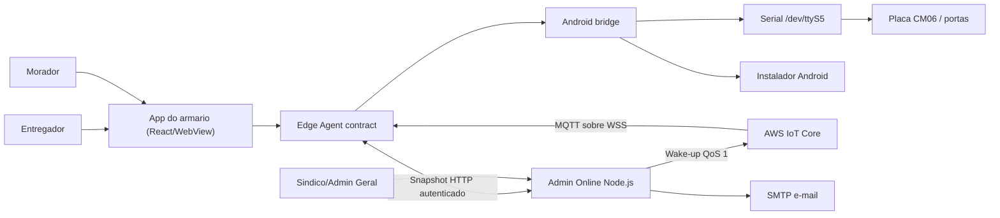

# PREDDITA Entregas Locker - Arquitetura tecnica

Este documento existe para ajudar outro programador a entender o projeto sem
precisar reconstruir toda a historia do armario. A solucao tem dois produtos:

- `web/`: app do armario, empacotado dentro do APK Android.
- `admin-online/`: painel web online para sindico e Admin Geral PREDDITA.

## Visao geral

O armario precisa ser local-first: se a internet cair, entrega e retirada
continuam acontecendo no equipamento. Quando a conexao volta, o app reenvia os
eventos pendentes ao painel online.

## App do armario

Principais arquivos:

- `web/src/App.jsx`: Kiosk UI e fluxos de entregador, morador e admin local.
- `web/src/edgeAgent.js`: contrato operacional entre a UI e o dispositivo. E a
  unica camada web que acessa serial, credencial nativa, persistencia offline,
  heartbeat, eventos e comandos do Admin Online.
- `web/src/lockerWorkflow.js`: regras puras de negocio. Nao acessa DOM, serial
  ou HTTP. E o melhor lugar para adicionar testes de regras.
- `web/src/serial.js`: protocolo RS-485, comandos e parse das respostas da placa.
- `web/src/doorSafety.js`: validacao das leituras e provas do ciclo fisico
  fechada-aberta-fechada.
- `web/src/remoteBridge.js`: HTTP entre app embarcado e Admin Online.
- `web/src/commandWakeup.js`: conexao MQTT WSS opcional, validacao,
  deduplicacao e reconexao com ticket temporario.
- `web/src/diagnostics.js`: testes de diagnostico executaveis dentro do armario.
- `android/app/src/main/java/.../MainActivity.java`: WebView e ponte JavaScript
  para ler/escrever na serial.
- `android/app/src/main/java/.../AppUpdateManager.java`: download, verificacao
  criptografica e handoff do APK ao instalador do sistema.

### Fronteira Edge Agent / Kiosk UI

O React nao importa `serial.js`, `remoteBridge.js` nem os diarios locais. Ele
consome uma instancia de `EdgeAgentRuntime`, envia snapshots de apresentacao e
fornece callbacks das transicoes de negocio. Assim, transporte e recuperacao
offline podem evoluir sem acoplar telas publicas a Android, HTTP ou
`localStorage`.

O contrato atual tem versao `2` e permite injetar hardware, rede, relogio,
atualizador e
storage em testes. O agente serializa cada ciclo remoto, persiste um comando
antes do acionamento e bloqueia reexecucao automatica quando um restart deixa o
resultado fisico desconhecido. A implementacao continua no mesmo APK para
preservar o deploy atual; transformar o agente em um Android Service separado
nao exige mudar os fluxos da Kiosk UI.

Fluxo do entregador:

1. Tela inicial mostra `Entregador` e `Buscar entrega`.
2. Entregador escolhe apartamento.
3. O app sempre tenta abrir uma porta pequena primeiro.
4. Se a encomenda couber, o entregador toca em `Item guardado`.
5. Se nao couber, ele toca em `A entrega nao cabe nessa porta`.
6. O app pede para fechar a porta pequena; quando o sensor confirmar, abre uma
   porta grande.
7. Ao confirmar o deposito, o app gera PIN e QR, grava a entrega localmente e
   enfileira o evento `delivery-stored` para o painel enviar e-mail.

Fluxo do morador:

1. Morador entra em `Buscar entrega`.
2. Informa PIN ou QR PREDDITA.
3. O app valida localmente contra as entregas ativas.
4. O app confirma uma leitura individual fechada, aciona a trava e exige que o
   sensor mude para aberta.
5. A entrega permanece em `pickup_opened` e ocupando a porta.
6. Somente uma nova leitura individual fechada conclui a retirada e enfileira
   `delivery-collected` para o painel.

## Admin Online

Principais arquivos:

- `admin-online/server.mjs`: servidor HTTP, autenticacao, persistencia,
  endpoints, e-mail SMTP, fila de comandos e ingestao de eventos do armario.
- `admin-online/iotCommandBus.mjs`: publicacao QoS 1 e emissao de tickets WSS
  AWS SigV4 com session policy por locker.
- `admin-online/public/app.js`: painel do sindico/Admin Geral em JavaScript
  puro.
- `admin-online/public/index.html`: estrutura do painel.
- `admin-online/public/styles.css`: estilo visual do painel.
- `admin-online/data/state.json`: banco local em arquivo JSON para ambiente lab.

Endpoints criticos:

- `GET /api/healthz`: healthcheck do servidor.
- `GET /api/admin/state`: estado completo para o painel.
- `POST /api/admin/residents`: cria apartamento/morador.
- `POST /api/admin/doors/:door/open`: cria comando remoto de abertura.
- `PUT /api/admin/update-policy`: publica ou pausa o rollout remoto do APK.
- `GET /api/device/snapshot`: armario busca moradores e comandos pendentes.
- `GET /api/device/mqtt-ticket`: emite conexao WSS temporaria e restrita ao
  topico exato do armario, ou informa que o MQTT esta desativado.
- `POST /api/device/status`: armario publica heartbeat, portas e entregas.
- `POST /api/device/events`: armario reenvia eventos offline.
- `POST /api/device/commands/:id/ack`: armario confirma o lease e registra o
  `executionId` antes de acionar a porta.
- `POST /api/device/commands/:id/complete`: armario confirma comando remoto.

## Atualizacao remota do APK

O Admin Online persiste uma politica por locker. O snapshot autenticado so
inclui o manifesto quando a distribuicao esta ativa, o locker pertence ao
percentual de rollout e o `versionCode` reportado ainda e inferior ao destino.
Somente `suporte` e `super_admin` podem alterar essa politica.

O Edge Agent anexa `device.appUpdater` ao heartbeat. Um manifesto so e entregue
ao bridge nativo na tela inicial, sem deposito/retirada aguardando fechamento e
sem comando remoto no ciclo. No Android, cada redirecionamento continua
obrigatoriamente em HTTPS, o arquivo tem limite de 250 MB e o SHA-256 e
comparado em tempo constante. O APK precisa manter o mesmo `applicationId`, ser
uma versao superior e usar exatamente o certificado do app instalado.

O instalador do sistema continua sendo a autoridade final. A primeira
atualizacao pode exigir autorizacao da fonte; ao retornar, hash, pacote, versao
e assinatura sao verificados novamente. Downgrade remoto e recusado: uma
recuperacao deve usar novo `versionCode` e a mesma chave de assinatura.

## Persistencia e sincronizacao offline

No Edge Agent do armario:

- Estado operacional fica em `localStorage` (`preddita_entregas_locker_state_v1`).
- Eventos offline usam um registro por evento sob o prefixo
  `preddita_device_event_journal_v2:`. A fila monolitica
  `preddita_pending_device_events_v1` e migrada automaticamente e so e removida
  depois que todos os registros validos forem gravados.
- Confirmacoes de comando remoto ficam em
  `preddita_pending_remote_completions_v1`.
- O diario de execucao fisica fica em
  `preddita_remote_command_executions_v1` e e gravado antes e depois da serial.

No servidor:

- Estado fica em `PREDDITA_DATA_DIR/state.json`.
- Escrita e feita de forma atomica e com backups.
- `processedDeviceEvents` guarda IDs ja processados para idempotencia.

Garantia pratica:

- Se o armario abrir uma porta sem internet, o evento fica local.
- Se o armario reiniciar antes de sincronizar, o evento continua no
  `localStorage`.
- Se um registro local ficar corrompido, os outros eventos continuam legiveis.
- Um evento so sai do diario depois que o servidor devolve seu ID como aceito;
  falhas de validacao voltam ao fim da fila sem descarte por tentativas.
- Se o mesmo evento for enviado duas vezes, o servidor aceita o replay sem
  duplicar e-mail ou retirada.

## Modelo de portas

O mapa fisico pertence a configuracao comissionada do locker. Cada canal guarda
um tamanho `P`, `M` ou `G`; o perfil inicial continua usando portas `1` e `2`
grandes e as demais pequenas somente como fallback para instalacoes antigas.

O app operacional usa `deviceConfig.doorSizes` ao reservar uma entrega e envia o
mesmo mapa ao Admin Online. O servidor preserva os tamanhos reportados e calcula
as quantidades livres separadamente para pequenas, medias e grandes.

## Comissionamento fisico

O modo tecnico possui um assistente que testa somente um canal por vez. Para
cada porta ele exige leitura individual fechada, aplica o tempo de acionamento,
abre a trava, confirma a transicao para aberta e espera a leitura fechada. O
primeiro canal conhecido como fechado determina a polaridade usada pelos demais.

Board, quantidade de portas, polaridade, tempo de acionamento, mapa de tamanhos e
as provas ficam em `deviceConfig.commissioning`. O registro so recebe status
`complete` quando todos os canais possuem ciclo e fechamento validos. Alterar
qualquer campo critico invalida o registro e exige novo comissionamento.

## Estados de entrega

- `door_opened_for_dropoff`: porta aberta para deposito, ainda sem confirmacao.
- `stored`: item guardado, PIN/QR validos para retirada.
- `pickup_opened`: porta aberta para retirada.
- `collected`: retirada concluida, porta liberada.
- `cancelled`: reserva/entrega cancelada.

Somente `door_opened_for_dropoff`, `stored` e `pickup_opened` ocupam porta.

## Confirmacao fisica das portas

Leituras em bloco servem apenas para o mapa visual. Uma operacao usa tres
leituras individuais com BCC valido: fechada antes do comando, aberta depois do
comando e fechada depois da abertura. As duas transicoes, canal, bytes,
polaridade e horarios ficam persistidos na entrega.

O perfil de polaridade e configurado por armario: `zeroOpen` interpreta `0x00`
como aberta e `0x11` como fechada; `zeroClosed` faz o inverso. Uma mudanca de
perfil exige comissionamento fisico. Timeout, leitura antiga, estado em bloco,
canal divergente ou byte sem transicao interrompem o fluxo.

## Comandos remotos

O painel nunca abre a porta diretamente. Ele cria um comando em fila:

1. Sindico/Admin clica em abrir.
2. Servidor cria comando `pending` e somente depois publica um wake-up MQTT.
3. O wake-up faz o armario antecipar `/api/device/snapshot`; o servidor cria um lease curto e
   muda o comando para `leased`.
4. Armario grava a execucao local e envia `/api/device/commands/:id/ack` com
   `leaseId` e `executionId`.
5. Servidor muda o comando para `executing`; somente entao o armario aciona a
   porta por RS-485.
6. Armario grava o resultado local antes de chamar
   `/api/device/commands/:id/complete`.
7. Servidor marca como `completed` ou `failed`; ACK e conclusao repetidos sao
   idempotentes. Abrir remotamente uma porta ocupada nao libera a entrega.
8. O app espera o fechamento fisico, conclui `pickup_opened` e sincroniza
   `delivery-collected`; o servidor tambem recusa `releasedDoor` sem prova de
   fechamento.

Se a resposta do snapshot se perder, o lease expira e o comando volta para a
fila. Se o app reiniciar depois do ACK, o diario local impede nova abertura e
reporta resultado fisico desconhecido para verificacao manual.

Se o armario estiver offline, stale, sem serial ou com comando pendente para a
mesma porta, a API bloqueia a abertura.

O MQTT nunca carrega moradores, comandos ou credenciais e nao altera estado. A
mensagem contem somente versao do schema, `eventId`, `lockerId`, motivo e
horario. QoS 1 reduz perdas, mas duplicatas sao esperadas e deduplicadas. Se
AWS IoT, STS ou WebSocket falhar, o polling HTTP de 6 segundos continua; com a
conexao MQTT saudavel, o snapshot de contingencia ocorre a cada 30 segundos.

O dispositivo solicita o ticket pela API HMAC. Por padrao, o servidor assume
uma role por 15 minutos e aplica session policy exata para `iot:Connect`, `iot:Subscribe` e
`iot:Receive`; a URL WSS SigV4 nao e persistida nem enviada na telemetria.

## Persistencia operacional

No modo Postgres, `preddita_locker_states` guarda somente configuracao, portas,
estado do dispositivo, outbox e diarios auxiliares. As colecoes principais sao
fontes relacionais separadas:

- `preddita_residents`: unidade, contato e revisao do cadastro.
- `preddita_deliveries`: status, porta, destinatario, datas e payload completo.
- `preddita_commands`: estado, lease, execucao, datas e timeline completa.
- `preddita_audit_events`: tipo, mensagem, metadados e horario do evento.

Todas usam chave composta por `tenant_id`, `locker_id` e identificador da
entidade. A escrita do estado principal e das quatro colecoes ocorre na mesma
transacao. Registros antigos com `operational_schema_version=0` recebem backfill
automatico no primeiro acesso; depois, a API hidrata o contrato antigo a partir
das tabelas e o JSONB deixa de duplicar essas colecoes.

Comandos sao a primeira entidade com mutacoes por linha. O Postgres bloqueia a
linha durante ACK e conclusao e bloqueia o locker durante criacao e efeitos que
tambem alteram portas, entregas ou auditoria. Indices unicos garantem uma unica
operacao ativa por porta e um unico comando por `executionId`; `revision` registra
cada transicao. Deadlocks e falhas de serializacao recebem ate tres tentativas.
Escritas genericas do snapshot nao atualizam mais `preddita_commands`, portanto
uma leitura antiga de outra instancia nao consegue regredir o comando.

## Variaveis de ambiente importantes

Servidor:

- `PREDDITA_ADMIN_USERS`: lista JSON de usuarios com `passwordHash` scrypt,
  papel, tenant e lockers permitidos.
- `PREDDITA_ADMIN_SESSION_TTL_MS`: validade maxima da sessao administrativa.
- `PREDDITA_ADMIN_LOGIN_RATE_LIMIT_PER_MINUTE`: limite de tentativas de login.
- `PREDDITA_MFA_ENCRYPTION_KEY`: chave Base64 de 32 bytes usada para cifrar os
  segredos TOTP de `super_admin` e `suporte` no Postgres.
- `PREDDITA_DEVICE_KEY`: chave usada pelo armario.
- `PREDDITA_DEVICE_KEYS`: mapa de uma chave diferente por `lockerId`.
- `PREDDITA_DEVICE_AUTH_MODE`: `hmac` em producao; `dual` existe apenas para
  migracao controlada em laboratorio.
- `PREDDITA_DEVICE_SIGNATURE_TTL_MS`: janela maxima da assinatura, 120 segundos
  por padrao.
- `PREDDITA_DATA_DIR`: pasta do `state.json`.
- `PREDDITA_COMMAND_TTL_MS`: prazo total do comando.
- `PREDDITA_COMMAND_LEASE_MS`: prazo para o armario confirmar a entrega.
- `PREDDITA_COMMAND_EXECUTION_LEASE_MS`: prazo da execucao antes de reconciliar.
- `PREDDITA_IOT_MODE`: `disabled` por padrao ou `aws-iot`.
- `PREDDITA_IOT_REGION` e `PREDDITA_IOT_ENDPOINT`: regiao e hostname Data-ATS.
- `PREDDITA_IOT_DEVICE_ROLE_ARN`: role temporaria assumida para cada ticket.
- `PREDDITA_IOT_TOPIC_PREFIX`: prefixo sem dados pessoais; `preddita/v1` por padrao.
- `PREDDITA_IOT_TICKET_TTL_SECONDS`: validade entre 900 e 3600 segundos.
- `PREDDITA_OPERATIONAL_LOG_RETENTION_DAYS`: retencao dos logs tecnicos; 30 dias
  por padrao.
- `PREDDITA_MAX_JSON_OPERATIONAL_LOGS`: limite do arquivo JSONL no modo de
  laboratorio; 5.000 registros por padrao.
- `PREDDITA_ALLOWED_ORIGINS`: CORS permitido.
- `PREDDITA_SMTP_HOST`, `PREDDITA_SMTP_PORT`, `PREDDITA_SMTP_SECURE`.
- `PREDDITA_SMTP_USER`, `PREDDITA_SMTP_PASS`, `PREDDITA_SMTP_FROM`.

Build do app:

- `VITE_PREDDITA_REMOTE_URL`: URL do Admin Online.
- `VITE_PREDDITA_LOCKER_ID`: identificador do locker.
- `VITE_PREDDITA_DEVICE_AUTH_MODE`: `hmac` por padrao; `legacy` somente para
  conectar temporariamente a um servidor antigo em laboratorio.
- `VITE_PREDDITA_EDGE_APP_VERSION`: versao reportada no heartbeat.

Em APK, URL, `lockerId` e chave sao provisionados no modo diagnostico. A chave
fica no Android Keystore e o JavaScript recebe somente assinaturas. Definir
`VITE_PREDDITA_DEVICE_KEY` em um build de producao causa falha deliberada.

Cada chamada `/api/device/*` assina metodo, rota, `lockerId`, timestamp, nonce e
SHA-256 do corpo com HMAC-SHA256. O servidor valida a janela de tempo e consome o
nonce uma unica vez, bloqueando alteracao do payload e replay da requisicao.

O painel autentica em `/api/auth/login`. O servidor devolve cookie de sessao
opaco, `HttpOnly`, `SameSite=Strict` e `Secure` em producao. Mutacoes exigem um
CSRF token mantido somente em memoria pela pagina. Os papeis `sindico`,
`operador`, `suporte` e `super_admin` sao validados no backend, inclusive para
escopo por `lockerId`, dados pessoais, exportacoes e operacao remota.

Cada chamada da API recebe um `x-request-id` e gera um registro estruturado sem
corpo, query string ou cabecalhos de autenticacao. Em Postgres, os registros
ficam em `preddita_operational_logs`; no modo local, em
`operational-logs.jsonl`. Suporte e Admin Geral podem filtrar e exportar esses
dados no painel. Senhas, tokens, PINs, CPF, contato e evidencias sao removidos
recursivamente do contexto antes da persistencia.

No modo Postgres, `PREDDITA_ADMIN_USERS` funciona como bootstrap e reconciliacao
da tabela `preddita_admin_users`. O cookie recebe um token aleatorio, mas o banco
guarda somente seu SHA-256 em `preddita_admin_sessions`. CSRF, expiracao,
restauracao apos restart e revogacao por logout passam pelo store compartilhado.
No modo JSON de laboratorio, as sessoes continuam somente na memoria.

Contas `super_admin` e `suporte` exigem TOTP antes da criacao da sessao. O
primeiro login cria um desafio de cadastro de cinco minutos e entrega dez
codigos de recuperacao de uso unico. Segredos TOTP usam AES-256-GCM; desafios
ficam apenas como SHA-256, aceitam no maximo cinco tentativas e sao consumidos
atomicamente. O ultimo passo TOTP aceito e persistido para impedir replay entre
replicas. Em producao, Postgres e `PREDDITA_MFA_ENCRYPTION_KEY` sao obrigatorios.

## Riscos conhecidos e proximos passos

- `web/src/App.jsx` ainda e grande. Antes de escalar para muitos armarios, vale
  separar em hooks/componentes por fluxo: entregador, morador, admin local e
  sincronizacao remota.
- Moradores, entregas, comandos e auditoria ja usam tabelas por locker. Portas,
  dispositivo, outbox e diarios auxiliares ainda ficam no snapshot JSONB.
- HTTPS e dominio proprio devem ser obrigatorios em producao.
- O envio de e-mail depende de SMTP externo; falhas ficam registradas para
  reprocessamento/diagnostico.
- Comandos ja usam updates por linha e foram exercitados com duas instancias. As
  demais entidades ainda substituem o conjunto completo lido pela aplicacao;
  mantenha uma replica ate moradores, entregas, auditoria, snapshot e workers
  tambem terem controle de concorrencia distribuido.
