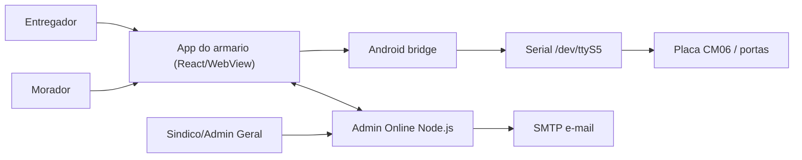

# PREDDITA Entregas Locker - Arquitetura tecnica

Este documento existe para ajudar outro programador a entender o projeto sem
precisar reconstruir toda a historia do armario. A solucao tem dois produtos:

- `web/`: app do armario, empacotado dentro do APK Android.
- `admin-online/`: painel web online para sindico e Admin Geral PREDDITA.

## Visao geral

O armario precisa ser local-first: se a internet cair, entrega e retirada
continuam acontecendo no equipamento. Quando a conexao volta, o app reenvia os
eventos pendentes ao painel online.

## App do armario

Principais arquivos:

- `web/src/App.jsx`: tela kiosk, fluxos de entregador, morador, admin local,
  ponte remota e chamadas de abertura de porta.
- `web/src/lockerWorkflow.js`: regras puras de negocio. Nao acessa DOM, serial
  ou HTTP. E o melhor lugar para adicionar testes de regras.
- `web/src/serial.js`: protocolo RS-485, comandos e parse das respostas da placa.
- `web/src/remoteBridge.js`: HTTP entre app embarcado e Admin Online.
- `web/src/diagnostics.js`: testes de diagnostico executaveis dentro do armario.
- `android/app/src/main/java/.../MainActivity.java`: WebView e ponte JavaScript
  para ler/escrever na serial.

Fluxo do entregador:

1. Tela inicial mostra `Entregador` e `Buscar entrega`.
2. Entregador escolhe apartamento.
3. O app sempre tenta abrir uma porta pequena primeiro.
4. Se a encomenda couber, o entregador toca em `Item guardado`.
5. Se nao couber, ele toca em `A entrega nao cabe nessa porta`.
6. O app pede para fechar a porta pequena; quando o sensor confirmar, abre uma
   porta grande.
7. Ao confirmar o deposito, o app gera PIN e QR, grava a entrega localmente e
   enfileira o evento `delivery-stored` para o painel enviar e-mail.

Fluxo do morador:

1. Morador entra em `Buscar entrega`.
2. Informa PIN ou QR PREDDITA.
3. O app valida localmente contra as entregas ativas.
4. A porta e aberta localmente.
5. A entrega e marcada como retirada e o evento `delivery-collected` e enviado
   ao painel quando houver internet.

## Admin Online

Principais arquivos:

- `admin-online/server.mjs`: servidor HTTP, autenticacao, persistencia,
  endpoints, e-mail SMTP, fila de comandos e ingestao de eventos do armario.
- `admin-online/public/app.js`: painel do sindico/Admin Geral em JavaScript
  puro.
- `admin-online/public/index.html`: estrutura do painel.
- `admin-online/public/styles.css`: estilo visual do painel.
- `admin-online/data/state.json`: banco local em arquivo JSON para ambiente lab.

Endpoints criticos:

- `GET /api/healthz`: healthcheck do servidor.
- `GET /api/admin/state`: estado completo para o painel.
- `POST /api/admin/residents`: cria apartamento/morador.
- `POST /api/admin/doors/:door/open`: cria comando remoto de abertura.
- `GET /api/device/snapshot`: armario busca moradores e comandos pendentes.
- `POST /api/device/status`: armario publica heartbeat, portas e entregas.
- `POST /api/device/events`: armario reenvia eventos offline.
- `POST /api/device/commands/:id/ack`: armario confirma o lease e registra o
  `executionId` antes de acionar a porta.
- `POST /api/device/commands/:id/complete`: armario confirma comando remoto.

## Persistencia e sincronizacao offline

No app do armario:

- Estado operacional fica em `localStorage` (`preddita_entregas_locker_state_v1`).
- Eventos offline usam um registro por evento sob o prefixo
  `preddita_device_event_journal_v2:`. A fila monolitica
  `preddita_pending_device_events_v1` e migrada automaticamente e so e removida
  depois que todos os registros validos forem gravados.
- Confirmacoes de comando remoto ficam em
  `preddita_pending_remote_completions_v1`.
- O diario de execucao fisica fica em
  `preddita_remote_command_executions_v1` e e gravado antes e depois da serial.

No servidor:

- Estado fica em `PREDDITA_DATA_DIR/state.json`.
- Escrita e feita de forma atomica e com backups.
- `processedDeviceEvents` guarda IDs ja processados para idempotencia.

Garantia pratica:

- Se o armario abrir uma porta sem internet, o evento fica local.
- Se o armario reiniciar antes de sincronizar, o evento continua no
  `localStorage`.
- Se um registro local ficar corrompido, os outros eventos continuam legiveis.
- Um evento so sai do diario depois que o servidor devolve seu ID como aceito;
  falhas de validacao voltam ao fim da fila sem descarte por tentativas.
- Se o mesmo evento for enviado duas vezes, o servidor aceita o replay sem
  duplicar e-mail ou retirada.

## Modelo de portas

Neste armario atual:

- Portas `1` e `2`: grandes (`G`).
- Todas as outras: pequenas (`P`).

Essa regra aparece em dois lugares e deve continuar alinhada:

- `web/src/lockerWorkflow.js` em `createDoorCatalog`.
- `admin-online/server.mjs` em `doorSizeForChannel`.

Sempre que mudar o perfil fisico do armario, atualize os dois lados e rode os
smoke tests.

## Estados de entrega

- `door_opened_for_dropoff`: porta aberta para deposito, ainda sem confirmacao.
- `stored`: item guardado, PIN/QR validos para retirada.
- `pickup_opened`: porta aberta para retirada.
- `collected`: retirada concluida, porta liberada.
- `cancelled`: reserva/entrega cancelada.

Somente `door_opened_for_dropoff`, `stored` e `pickup_opened` ocupam porta.

## Comandos remotos

O painel nunca abre a porta diretamente. Ele cria um comando em fila:

1. Sindico/Admin clica em abrir.
2. Servidor cria comando `pending`.
3. Armario busca via `/api/device/snapshot`; o servidor cria um lease curto e
   muda o comando para `leased`.
4. Armario grava a execucao local e envia `/api/device/commands/:id/ack` com
   `leaseId` e `executionId`.
5. Servidor muda o comando para `executing`; somente entao o armario aciona a
   porta por RS-485.
6. Armario grava o resultado local antes de chamar
   `/api/device/commands/:id/complete`.
7. Servidor marca como `completed` ou `failed`; ACK e conclusao repetidos sao
   idempotentes.

Se a resposta do snapshot se perder, o lease expira e o comando volta para a
fila. Se o app reiniciar depois do ACK, o diario local impede nova abertura e
reporta resultado fisico desconhecido para verificacao manual.

Se o armario estiver offline, stale, sem serial ou com comando pendente para a
mesma porta, a API bloqueia a abertura.

## Variaveis de ambiente importantes

Servidor:

- `PREDDITA_ADMIN_TOKEN`: token do sindico.
- `PREDDITA_SUPER_ADMIN_TOKEN`: token do Admin Geral PREDDITA.
- `PREDDITA_DEVICE_KEY`: chave usada pelo armario.
- `PREDDITA_DATA_DIR`: pasta do `state.json`.
- `PREDDITA_COMMAND_TTL_MS`: prazo total do comando.
- `PREDDITA_COMMAND_LEASE_MS`: prazo para o armario confirmar a entrega.
- `PREDDITA_COMMAND_EXECUTION_LEASE_MS`: prazo da execucao antes de reconciliar.
- `PREDDITA_ALLOWED_ORIGINS`: CORS permitido.
- `PREDDITA_SMTP_HOST`, `PREDDITA_SMTP_PORT`, `PREDDITA_SMTP_SECURE`.
- `PREDDITA_SMTP_USER`, `PREDDITA_SMTP_PASS`, `PREDDITA_SMTP_FROM`.

Build do app:

- `VITE_PREDDITA_REMOTE_URL`: URL do Admin Online.
- `VITE_PREDDITA_DEVICE_KEY`: chave do armario.
- `VITE_PREDDITA_LOCKER_ID`: identificador do locker.
- `VITE_PREDDITA_EDGE_APP_VERSION`: versao reportada no heartbeat.

## Riscos conhecidos e proximos passos

- `web/src/App.jsx` ainda e grande. Antes de escalar para muitos armarios, vale
  separar em hooks/componentes por fluxo: entregador, morador, admin local e
  sincronizacao remota.
- `admin-online` usa JSON em arquivo, adequado para laboratorio e piloto. Para
  30 armarios, migrar para Postgres e modelar `lockers`, `doors`, `residents`,
  `deliveries`, `commands` e `events` por `lockerId`.
- HTTPS e dominio proprio devem ser obrigatorios em producao.
- O envio de e-mail depende de SMTP externo; falhas ficam registradas para
  reprocessamento/diagnostico.
