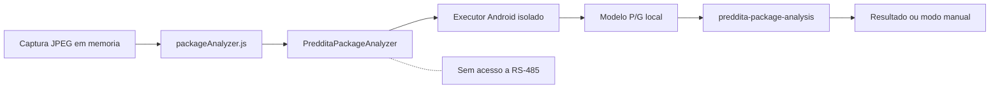

# Contrato do analisador local de pacotes

## Objetivo

Definir a fronteira entre o React executado no WebView e o analisador Android
da Entrega Inteligente. Essa fronteira recebe uma foto JPEG, processa tudo no
dispositivo e devolve um resultado sanitizado. Ela nao conhece placa, canal,
sensor, reserva ou comando RS-485.

**Contrato:** schema `1`, bridge `PREDDITA-PACKAGE-ANALYZER-1.0.0`.

**Estado atual:** a bridge e o executor offline estao implementados. O modelo
P/G ainda nao foi treinado nem aprovado; por isso o Android responde
`uncertain/model-not-installed`. Isso e um bloqueio seguro e esperado.

## Fronteira



## API Android exposta ao WebView

| Metodo | Retorno | Responsabilidade |
| --- | --- | --- |
| `getBridgeVersion()` | string | Versao da bridge |
| `getInfo()` | JSON string | Schema, versao, disponibilidade e checksum do modelo |
| `analyze(requestJson)` | boolean | Aceita uma analise em segundo plano ou recusa quando ocupada |

Somente uma analise pode ficar em voo. O retorno final chega pelo evento
`preddita-package-analysis` e precisa conter o mesmo `requestId`.

## Requisicao

```json
{
  "schemaVersion": 1,
  "requestId": "package-exemplo-001",
  "photoDataUrl": "data:image/jpeg;base64,<jpeg-base64>",
  "capturedAt": "2026-07-22T12:00:00.000Z",
  "captureQuality": 0.91
}
```

Campos de porta, placa, apartamento, morador ou credencial nao pertencem ao
contrato e nao sao enviados.

## Resultado

```json
{
  "schemaVersion": 1,
  "requestId": "package-exemplo-001",
  "status": "uncertain",
  "suggestedSize": "",
  "confidence": null,
  "captureQuality": 0.91,
  "modelVersion": "package-pg-v1",
  "modelSha256": "",
  "inferenceMs": 25,
  "reasonCode": "model-not-installed",
  "imageWidth": 640,
  "imageHeight": 360
}
```

Um resultado `ready` so e aceito pelo JavaScript quando o tamanho e `P` ou
`G`, a confianca e pelo menos `0,90`, versao e SHA-256 coincidem com
`getInfo()` e o modelo esta marcado como disponivel. A recomendacao expira dois
minutos depois da captura. Qualquer resposta fora desse contrato e convertida
em `uncertain` ou `failed` e nunca autoriza porta.

## Falhas seguras

- `model-not-installed`: artefato ainda ausente;
- `model-checksum-mismatch`: arquivo diferente do aprovado;
- `model-runtime-not-installed`: executor do modelo ainda ausente;
- `low-capture-quality`: foto abaixo do gate local;
- `invalid-image`: payload, JPEG ou dimensoes invalidas;
- `unsupported-schema`: contrato incompativel;
- `analyzer-busy`: ja existe analise em voo;
- `analyzer-timeout`: o WebView nao recebeu resposta em cinco segundos;
- `analyzer-error`: falha nativa sanitizada.
- `unverified-model-result`: identidade ou checksum diverge de `getInfo()`.

## Limites e privacidade

- somente JPEG data URL com ate `900.000` caracteres;
- dimensao maxima de `4096x4096` e ate oito milhoes de pixels;
- foto mantida em memoria, nao devolvida no resultado e apagada antes da
  reserva;
- nenhum log ou evento recebe a imagem;
- modelo so fica disponivel quando o SHA-256 coincide com o valor compilado;
- timeout, cancelamento ou troca para modo manual invalidam o resultado tardio;
- bridge do analisador e bridge `Android` de RS-485 sao objetos distintos.

## Telemetria operacional

O resultado tecnico pode alimentar um diario local separado da foto. O schema
desse diario aceita somente acao, resultado, tamanho `P/G`, codigo fechado de
motivo, faixa de qualidade, inferencia arredondada, versao do modelo e horario.
O limite local e de 100 eventos por sete dias.

A jornada enviada pelo Edge Agent usa o schema `2` e informa somente a
modalidade, resultado da analise, confirmacao e resultado da alocacao. O Admin
Online aplica uma segunda normalizacao e conserva no maximo 500 amostras por
30 dias. Nenhum dos dois contratos aceita foto, apartamento, pessoa,
credencial, etiqueta, porta ou texto livre.

## Validacao

- `scripts/PackageAnalysisContractTest.java`: schema, JPEG, limites, tamanho,
  confianca e sanitizacao;
- `scripts/package-analyzer-bridge-test.mjs`: correlacao, timeout, fila ocupada,
  bridge ausente e resposta insegura;
- `scripts/smart-delivery-telemetry-test.mjs`: allowlists, minimizacao, limite,
  retencao e limpeza local;
- `web/e2e/kiosk-flow.spec.js`: captura inconclusiva sem comandos, revisao
  `P/G`, catalogo exato, reserva posterior a confirmacao, descarte da foto e
  indisponibilidade sem fallback;
- `web/e2e/kiosk-layout.spec.js`: captura, resultado e revisao nos quatro
  viewports.

O build Android local exige SDK 34. O CI instala esse SDK antes de executar
`./gradlew --no-daemon assembleDebug`.
