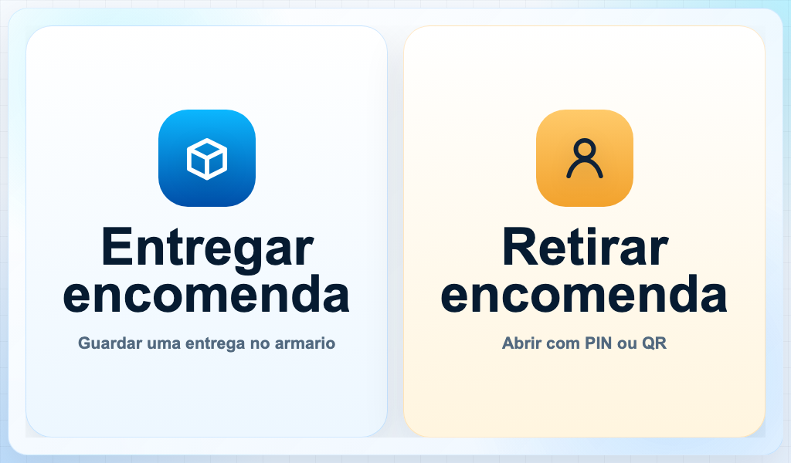

# Baseline visual e funcional do Kiosk V3

## Objetivo

Esta pagina preserva a referencia da interface publica `2.0.25-lab` antes da
fundacao visual do Kiosk V4. O baseline permite comparar o redesign sem perder
navegacao, acessibilidade, persistencia ou os contratos de abertura e
fechamento de porta.

**Data da captura:** 20 de julho de 2026.

**Viewport de referencia:** `1024x600`, escala `1x`, Chromium headless e
movimento reduzido.

**Escopo:** estabilizacao responsiva e protecao contra regressao. Nao houve
mudanca de versao, schema, protocolo serial ou regra de conclusao de porta.

## Catalogo visual

| Ordem | Estado | Arquivo |
| --- | --- | --- |
| 1 | Inicio | [01-inicio.png](assets/kiosk-v3-baseline/01-inicio.png) |
| 2 | Escolha do apartamento | [02-apartamento.png](assets/kiosk-v3-baseline/02-apartamento.png) |
| 3 | Confirmacao | [03-confirmacao.png](assets/kiosk-v3-baseline/03-confirmacao.png) |
| 4 | Porta aberta | [04-porta.png](assets/kiosk-v3-baseline/04-porta.png) |
| 5 | Entrega salva | [05-sucesso.png](assets/kiosk-v3-baseline/05-sucesso.png) |
| 6 | Entrada por PIN | [06-pin.png](assets/kiosk-v3-baseline/06-pin.png) |
| 7 | Entrada por QR | [07-qr.png](assets/kiosk-v3-baseline/07-qr.png) |
| 8 | Erro recuperavel | [08-erro.png](assets/kiosk-v3-baseline/08-erro.png) |
| 9 | Timeout de fechamento | [09-timeout.png](assets/kiosk-v3-baseline/09-timeout.png) |



## Metricas iniciais

Os valores abaixo foram medidos no servidor local, sem rede externa. Eles sao
uma referencia comparativa, nao um SLA de equipamento de campo.

| Metrica | Valor |
| --- | ---: |
| Primeira tela pronta | `302,2 ms` |
| DOM carregado | `115,5 ms` |
| Evento `load` | `116,1 ms` |
| Bundle sem compressao | `875.327 bytes` |
| Bundle gzip | `260.488 bytes` |
| Erros de console nas capturas | `0` |

O detalhamento por arquivo e os dados brutos ficam em
[metrics.json](assets/kiosk-v3-baseline/metrics.json). O tempo de primeira tela
e medido quando a acao `Entregar encomenda` esta disponivel para interacao.

## Matriz de regressao

O Playwright executa a jornada publica nos seguintes projetos:

| Projeto | Viewport | Finalidade |
| --- | --- | --- |
| `kiosk-1024x600` | `1024x600` | painel de referencia |
| `desktop-1280x800` | `1280x800` | navegador de desenvolvimento |
| `compact-800x480` | `800x480` | painel horizontal baixo |
| `portrait-390x844` | `390x844` | regressao de composicao e scroll interno |

`kiosk-layout.spec.js` percorre inicio, apartamento, confirmacao, porta,
sucesso, nova entrega, retorno, PIN, QR e erro. Em cada estado ele verifica:

- overflow externo;
- controles fora da tela ou da area rolavel;
- texto cortado;
- sobreposicao de controles;
- nome acessivel e foco visivel;
- erros do console.

Uma falha controlada move a acao principal para fora do viewport e confirma
que a auditoria realmente detecta a regressao. Screenshot, video e trace sao
retidos somente quando um teste falha.

`kiosk-interactions.spec.js` congela os contratos de teclado numerico, apagar,
retorno, cancelamento e timeout. O timeout usa o relogio virtual do Playwright,
portanto nao adiciona uma espera real de 60 segundos ao CI.

## Reproducao

Em `web`, depois de instalar as dependencias e o Chromium:

```powershell
npm run capture:baseline
```

O comando recompila o frontend, serve o mesmo bundle usado pelo Android e
substitui os arquivos em `docs/assets/kiosk-v3-baseline`. Uma nova captura so
deve ser publicada quando a mudanca de referencia for intencional e explicada
em `docs/UPDATES.md`.

## Rollback preservado

O rollback funcional continua sendo o GitHub Release
[`v2.0.25-lab`](https://github.com/PredditaTi/Locker-Preddita/releases/tag/v2.0.25-lab),
publicado em 16 de julho de 2026.

| Item | Valor |
| --- | --- |
| APK | `PREDDITA-Locker-2.0.25-lab-release.apk` |
| Tamanho | `2.844.682 bytes` |
| SHA-256 | `29758e031d745bd6ad02eb761413696511cb42e0c000fb4d7fa86e23129dc667` |
| Checksum | `PREDDITA-Locker-2.0.25-lab-release.apk.sha256` |

O binario nao e duplicado no repositorio. O release e seu checksum sao a fonte
de rollback, e a instalacao continua sujeita a assinatura e `versionCode` do
Android.
