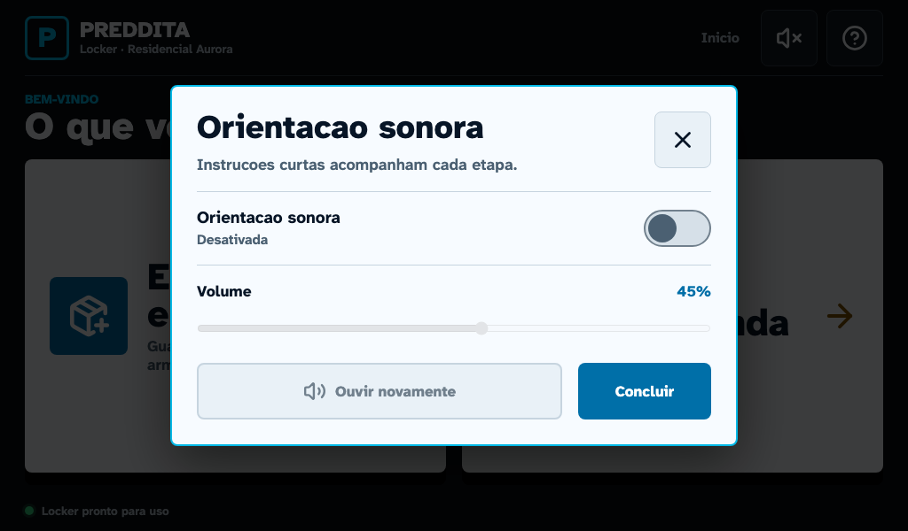
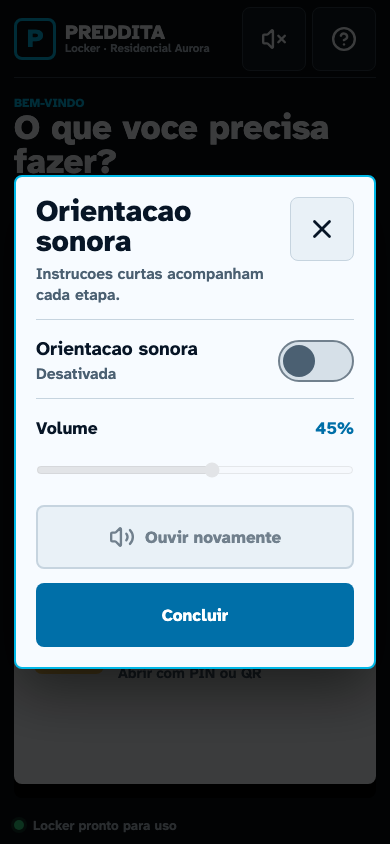

# Kiosk V4 - orientacao sonora acessivel

## Resultado

A Parte 4 adiciona orientacao sonora opcional as jornadas publicas sem TTS,
rede ou dados pessoais. O recurso inicia mudo, funciona inteiramente com
arquivos locais e nao altera regras de porta, API, schema ou versao do produto.

**Base:** `2.0.25-lab`, `versionCode 25`, `schemaVersion 12`.

## Politica

- somente 12 IDs fechados em `web/src/audioGuidance.js` podem tocar;
- nenhum texto e montado em runtime;
- nome, apartamento, bloco, numero de porta, PIN e QR nunca entram na fala;
- erro e cancelamento possuem prioridade sobre a instrucao da tela;
- a troca de etapa interrompe o prompt anterior;
- rerender da mesma etapa nao repete o arquivo;
- o usuario pode repetir a instrucao pelo dialogo;
- o volume fica limitado entre 20% e 65%;
- apenas `muted` e `volume` ficam em `localStorage`;
- o estado inicial e mudo e toda a jornada continua operavel assim.

O armazenamento usa a chave `preddita_kiosk_audio_preferences_v1`. Nao ha
identificador de pessoa, jornada, unidade, destino ou credencial nessa chave.

## Prompts aprovados

| ID | Uso |
| --- | --- |
| `home` | Escolha entre entregar e retirar |
| `courier-choice` | Entrada e escolha de destino |
| `courier-confirm` | Confirmacao visual do destino |
| `courier-dropoff` | Deposito e fechamento |
| `courier-close` | Espera pela prova de fechamento |
| `courier-success` | Entrega concluida |
| `pickup-pin` | Entrada dos seis numeros |
| `pickup-qr` | Posicionamento do codigo na camera |
| `pickup-open` | Retirada e fechamento |
| `pickup-success` | Retirada concluida |
| `cancel` | Cancelamento fisicamente seguro |
| `error` | Falha recuperavel |

O texto exato, arquivo, duracao, tamanho e SHA-256 estao no
[`manifest.json`](../web/src/assets/audio/manifest.json). A origem e o estado de
distribuicao estao registrados no
[`README` dos assets](../web/src/assets/audio/README.md). Os arquivos atuais
sao de laboratorio; a permissao de distribuicao da voz de sistema usada na
geracao precisa ser confirmada ou os audios devem ser substituidos antes de
producao.

## Interface e acessibilidade

O botao da barra superior e somente um icone Lucide, com tooltip e nome
acessivel que informam o estado. Ele abre um dialogo com:

- switch nativo para ligar ou desligar;
- slider com limites visiveis e programaticos;
- comando para ouvir novamente;
- fechamento por icone, botao, `Escape` ou navegacao por `Tab`;
- foco inicial, foco preso no dialogo e restauracao ao controle de origem.

O dialogo foi auditado com `prefers-reduced-motion: reduce` e sem overflow em
`1024x600` e `390x844`. A auditoria geral tambem o percorre nos quatro
viewports do Playwright.

### Painel de referencia - 1024x600



### Retrato estreito - 390x844



As geometrias e erros de navegador das capturas ficam em
[`metrics.json`](assets/kiosk-v4-audio/metrics.json).

## Arquitetura

`createAudioGuidanceController` concentra allowlist, prioridade, interrupcao,
volume, persistencia e deduplicacao. `KioskAudioProvider` mantem o controlador
vivo durante a navegacao publica e seleciona o prompt ativo de maior
prioridade. Cada tela apenas registra seu ID fixo.

O navegador/WebView reproduz os arquivos empacotados com `Audio`. Nao foi
necessaria uma API nova no bridge Android: o volume controlado pela aplicacao
atende o hardware atual e evita ampliar a superficie nativa sem necessidade.

Os 12 M4A somam `450.550 bytes`. O bundle Android completo passou para
`1.416.595 bytes` sem compressao, principalmente pelos novos audios.

## Validacao e reproducao

Em `web`:

```powershell
npm run test:audio
npm run build
npm run test:e2e
npm run capture:v4-audio
```

`test:audio` verifica a lista fechada, transcricoes, termos proibidos, hashes,
tamanhos, volume, prioridade, interrupcao, deduplicacao e formato da
preferencia persistida. `kiosk-audio.spec.js` verifica o comportamento real em
`1024x600`, `1280x800`, `800x480` e `390x844`.

## Limites antes do piloto

- confirmar direitos de distribuicao dos arquivos atuais ou substitui-los por
  gravacoes liberadas;
- validar inteligibilidade, nivel maximo e alto-falante no locker real;
- confirmar com usuarios e operacao que o estado inicial mudo e adequado ao
  local de instalacao;
- manter TTS dinamico fora do produto enquanto nao houver uma politica de
  privacidade e uma necessidade aprovada.
