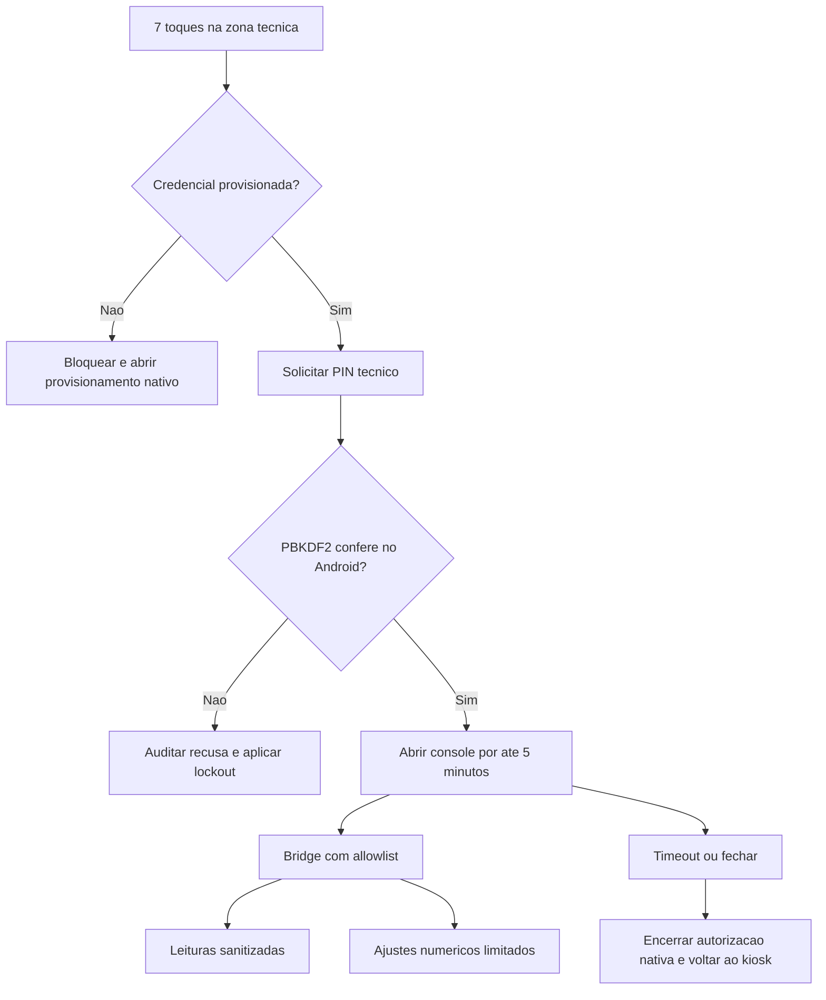
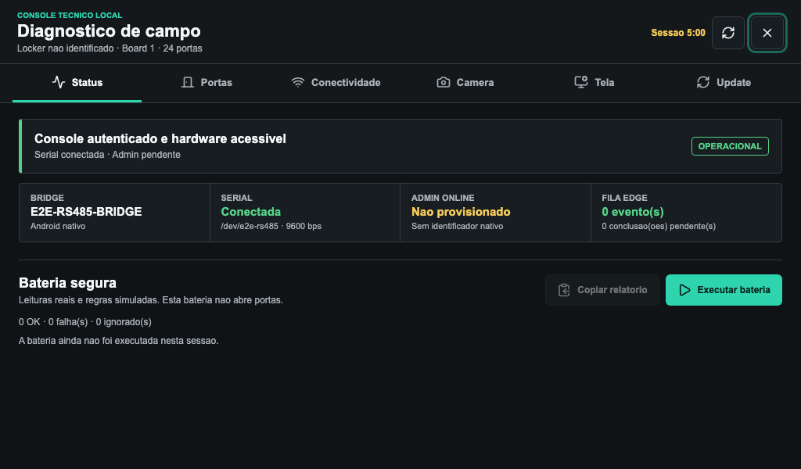
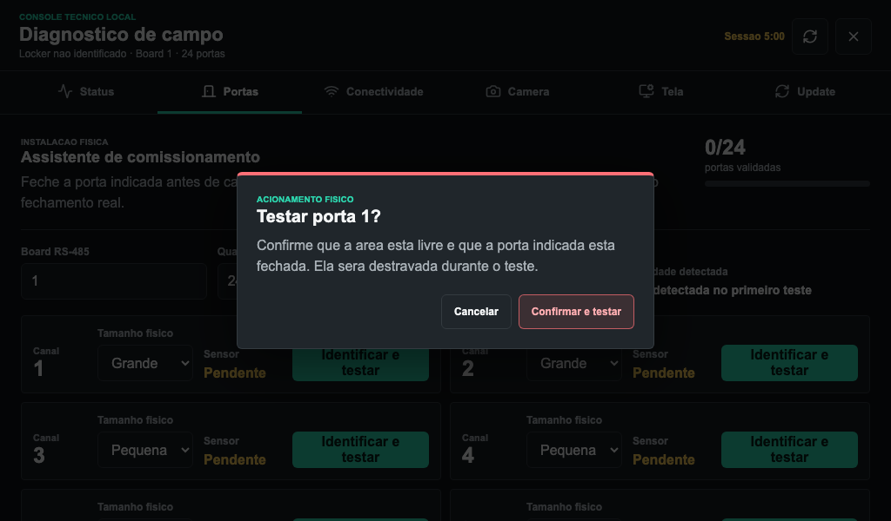
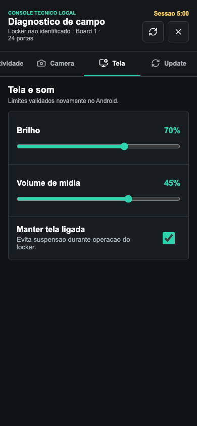

# Kiosk V4 - Console tecnico e diagnostico de campo

**Status:** Parte 5 concluida em laboratorio em 21 de julho de 2026.

Este documento descreve o console local usado por instalacao e suporte. Ele nao
e um terminal remoto: a interface possui uma lista fechada de leituras e
ajustes, exige uma credencial provisionada no Android e registra as acoes no
diario do locker.

## Resultado entregue

- acesso oculto por sete toques no canto superior direito em ate cinco segundos;
- bloqueio fechado quando o PIN tecnico nao esta provisionado;
- PIN de 8 a 12 digitos derivado com PBKDF2-HMAC-SHA256, salt aleatorio e
  comparacao constante; o valor original nao e persistido;
- bloqueio nativo persistente por 60 segundos depois de cinco tentativas invalidas;
- sessao web e nativa de cinco minutos, encerrada por inatividade, fechamento
  ou desmontagem do app;
- seis abas: `Status`, `Portas`, `Conectividade`, `Camera`, `Tela` e `Update`;
- confirmacao explicita antes de cada teste fisico de porta;
- ajustes de brilho, volume e tela ligada limitados no JavaScript e novamente
  no Android;
- erros sanitizados na UI e detalhes tecnicos restritos aos logs do dispositivo;
- auditoria com ator, locker, horario, resultado, board e canal quando aplicavel.

## Fluxo de acesso



O parametro `?diagnostics=1`, o PIN salvo em `localStorage` e a abertura sem
credencial foram removidos. Um PIN de desenvolvimento so pode existir durante
`vite dev`, por `VITE_PREDDITA_DIAGNOSTIC_PIN`; ele nao e aceito no build de
producao.

## Primeiro provisionamento

1. Execute os sete toques na zona tecnica.
2. Sem credencial, o console permanece fechado e o Android abre o formulario
   nativo de provisionamento.
3. Informe URL HTTPS do Admin Online, `lockerId`, chave HMAC individual com no
   minimo 32 caracteres e PIN tecnico de 8 a 12 digitos.
4. Depois de salvar, repita os sete toques e autentique com o PIN.
5. Dentro de `Conectividade`, use `Provisionar` para rotacionar a conexao ou o
   PIN. Deixar o PIN vazio preserva o valor atual.

A chave HMAC continua protegida pelo Android Keystore. Para o PIN tecnico, o
Android salva apenas salt, hash derivado e data de provisionamento em
`SharedPreferences` privado. Os campos de chave e PIN sao limpos ao salvar,
cancelar ou fechar o formulario.

Se o PIN for perdido, nao existe bypass por URL ou valor padrao. O procedimento
de recuperacao deve apagar os dados do app por uma sessao ADB autorizada e
repetir o provisionamento completo do locker.

## Abas e operacao

| Aba | Informacoes e comandos |
| --- | --- |
| Status | Bridge, serial, provisionamento HMAC, filas e bateria segura sem abertura |
| Portas | Board, mapa fisico, polaridade, tempo e teste individual com prova fechada-aberta-fechada |
| Conectividade | Serial, ultimo frame, reconexoes, rede, ultimo sync/latencia, MQTT, filas, provisionamento e retry |
| Camera | Disponibilidade, permissao e preview local temporario sem captura ou envio |
| Tela | Brilho entre 10% e 100%, volume entre 0% e 65% e opcao de manter tela ligada |
| Update | Versao, alvo, progresso, falha sanitizada, armazenamento livre e tamanho dos diarios web |

O preview da camera para ao trocar de aba, fechar o console ou desmontar a
interface. A bateria segura consulta hardware e contratos, mas nao aciona
portas. A abertura fisica fica exclusivamente no assistente de comissionamento.

## Contrato da bridge Android

Objeto exposto ao WebView: `window.PredditaDiagnostics`.

| Metodo | Entrada | Protecao |
| --- | --- | --- |
| `getCredentialStatus()` | nenhuma | Retorna somente estado minimo do provisionamento |
| `verifyPin(pin)` | PIN numerico | PBKDF2, cinco tentativas e lockout de 60 segundos |
| `openProvisioning()` | nenhuma | Abre formulario nativo; nenhum dado e recebido da pagina |
| `endSession()` | nenhuma | Revoga imediatamente a autorizacao nativa |
| `getStatus()` | nenhuma | Exige sessao e devolve JSON sanitizado |
| `setBrightnessPercent(int)` | `10..100` | Sessao e limite revalidados no Android |
| `setMediaVolumePercent(int)` | `0..65` | Sessao e limite revalidados no Android |
| `setKeepScreenOn(boolean)` | booleano | Sessao e tipo estrito |
| `retrySerial()` | nenhuma | Sessao; reinicia apenas o driver conhecido pelo app |

Nao existem metodos para shell, leitura de arquivo, caminho informado pela UI,
URL arbitraria, frame serial livre ou nome de comando. A pagina converte os
controles para numeros, rejeita texto e nunca repassa detalhes do erro serial.

## Teste de porta

Cada teste segue estas garantias:

1. exige sessao tecnica autenticada;
2. mostra confirmacao com foco inicial em `Cancelar`;
3. registra evento `started` com board e canal;
4. confirma leitura individual fechada e infere a polaridade;
5. configura o tempo limitado e destrava somente o canal escolhido;
6. exige transicao real para aberta;
7. aguarda nova leitura individual fechada por ate 45 segundos;
8. salva a prova somente quando o ciclo completo passa;
9. registra `passed` ou `failed`, sem expor a resposta bruta na UI.

## Auditoria

Os eventos usam `actor=technical-local`, `lockerId`, horario e `outcome`.

- `diagnostic-access`: abertura, recusa, bloqueio, fechamento e timeout;
- `diagnostic-suite`: inicio e resultado da bateria segura;
- `diagnostic-door-test`: inicio, falha ou prova concluida por canal;
- `diagnostic-commissioning`: conclusao ou recusa do mapa fisico;
- `diagnostic-display`: brilho, volume e tela ligada;
- `diagnostic-serial`: solicitacao de reconexao;
- `diagnostic-camera`: inicio, recusa e encerramento do preview;
- `diagnostic-provisioning`: abertura ou indisponibilidade do formulario nativo.

O diario local mantem ate 160 eventos recentes, suficiente para inicio e
resultado dos 24 canais na mesma rodada. Esta etapa nao altera a politica de
retencao do Admin Online.

## Evidencias visuais

Status no viewport de referencia:



Confirmacao antes do acionamento fisico:



Controles de tela no viewport retrato:



As tres capturas preencheram exatamente o viewport, tiveram overflow horizontal
zero e nao produziram erro no navegador. As metricas reproduziveis estao em
`docs/assets/kiosk-v4-diagnostics/metrics.json`.

## Testes e validacao

```bash
cd web
npm run test:diagnostics
npm run build
npx playwright test e2e/kiosk-diagnostics.spec.js
npx playwright test e2e/kiosk-layout.spec.js
npm run capture:v4-diagnostics
```

Cobertura adicionada:

- contrato Java puro para PIN, limites e sanitizacao serial;
- contrato JavaScript para tipos, limites e ausencia de APIs arbitrarias;
- URL e falta de PIN bloqueadas;
- PIN invalido recusado e auditado;
- seis abas, controles e bridge nativa simulada;
- confirmacao, abertura, fechamento comprovado e auditoria da porta;
- timeout de cinco minutos e retorno a tela inicial;
- matriz `1024x600`, `1280x800`, `800x480` e `390x844`.

O build Vite, os contratos puros e os testes Playwright passaram neste Mac. O
`assembleDebug` local nao pode iniciar porque o Android SDK nao esta instalado
nem existe `android/local.properties`; a compilacao Android permanece no gate
da CI. Ainda e obrigatorio validar serial, camera, audio, brilho e 24 canais no
KS1062 antes do piloto.

Na execucao final, a suite Playwright completa terminou com 45 cenarios
aprovados e 27 skips condicionais esperados. A matriz dedicada ao console teve
14 aprovacoes e 6 skips de ciclos fisicos redundantes.

## Arquivos principais

- `web/src/useDiagnosticGate.js`
- `web/src/diagnosticBridge.js`
- `web/src/DiagnosticsView.jsx`
- `web/src/CommissioningPanel.jsx`
- `android/app/src/main/java/com/preddita/entregaslocker/DiagnosticControlContract.java`
- `android/app/src/main/java/com/preddita/entregaslocker/DiagnosticCredentialStore.java`
- `android/app/src/main/java/com/preddita/entregaslocker/MainActivity.java`
- `web/e2e/kiosk-diagnostics.spec.js`
- `scripts/diagnostic-console-test.mjs`
- `scripts/DiagnosticControlContractTest.java`

## Gate de campo

- provisionar credenciais unicas em um equipamento limpo;
- comprovar lockout depois de cinco PINs invalidos;
- deixar a sessao inativa por cinco minutos e confirmar retorno ao kiosk;
- validar limites reais de brilho e volume no Android;
- iniciar e encerrar o preview da camera;
- desconectar e reconectar a serial pelo comando permitido;
- testar os 24 canais e preservar uma prova fechada-aberta-fechada por canal;
- conferir ator, locker, horario e resultado no diario;
- confirmar que nenhum erro da UI revela chave, payload, caminho inesperado ou
  detalhe interno do Android.
