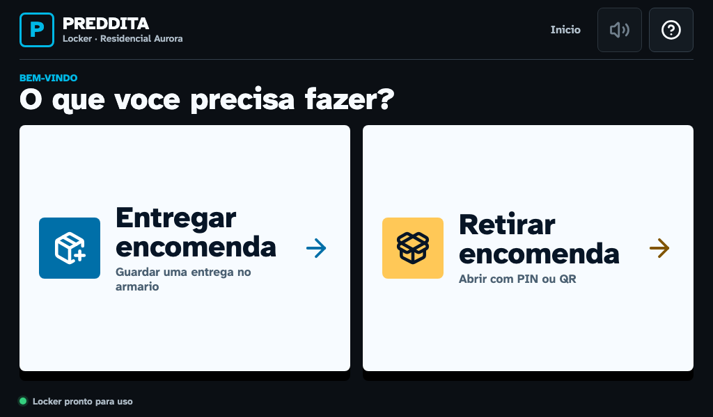

# Fundacao visual e home do Kiosk V4

## Objetivo

Esta pagina registra a Parte 2 do plano do Kiosk V4: a nova linguagem visual,
a home publica em producao e cinco prototipos navegaveis para aprovacao do
produto. Regras de entrega, retirada e acionamento fisico permanecem na V3 ate
a Parte 3.

**Base:** produto `2.0.25-lab`, `versionCode 25`, `schemaVersion 12`.

**Viewport de referencia:** `1024x600`, escala `1x`, Chromium headless e
movimento reduzido.

**Status:** implementacao tecnica concluida; as cinco referencias aguardam
aprovacao visual do responsavel do produto antes da Parte 3.

## O que entrou no produto

- home full-screen com duas acoes estaveis: entregar e retirar;
- barra superior com marca, local, etapa, ajuda e audio identificado;
- ajuda funcional e audio explicitamente indisponivel ate a Parte 4;
- tokens exclusivos em `web/src/kioskTheme.css`, sem alterar o Admin Online;
- fonte Atkinson Hyperlegible Next empacotada no bundle;
- icones Lucide no lugar do SVG manual da home;
- estados de foco, pressionado, carregando, desabilitado e indisponivel;
- prototipos locais de inicio, apartamento, porta, PIN e sucesso;
- testes de contraste, alvo de toque, navegacao, overflow e console.

O modo de prototipo e ativado somente por `?kioskPrototype=<etapa>`. Ele usa
dados ficticios, nao inicializa `App`, nao chama o Edge Agent e nao aciona
hardware. As etapas aceitas sao `home`, `apartment`, `door`, `pin` e `success`.

## Direcao visual

| Papel | Token | Valor |
| --- | --- | --- |
| Fundo | `--kiosk-bg` | `#0b0f14` |
| Superficie | `--kiosk-surface` | `#f7fbff` |
| Texto em superficie | `--kiosk-ink` | `#071526` |
| Marca e progresso | `--kiosk-brand` | `#00b8e6` |
| Acao primaria | `--kiosk-brand-dark` | `#006fa8` |
| Atencao | `--kiosk-warning` | `#ffc857` |
| Sucesso | `--kiosk-success` | `#35d07f` |
| Erro | `--kiosk-danger` | `#ef5d68` |
| Foco | `--kiosk-focus` | `#69dcff` |

O layout nao usa gradiente, vidro, grade decorativa ou moldura de dashboard na
home. Bordas tem raio maximo de 8 px, fontes usam tamanhos fixos por breakpoint
e os alvos de toque publicos possuem pelo menos 64 px. O feedback de toque usa
transicao de 80 ms e e removido quando `prefers-reduced-motion` esta ativo.

## Home responsiva

| Viewport | Referencia |
| --- | --- |
| `1024x600` | [home-1024x600.png](assets/kiosk-v4-foundation/home-1024x600.png) |
| `1280x800` | [home-1280x800.png](assets/kiosk-v4-foundation/home-1280x800.png) |
| `800x480` | [home-800x480.png](assets/kiosk-v4-foundation/home-800x480.png) |
| `390x844` | [home-390x844.png](assets/kiosk-v4-foundation/home-390x844.png) |



## Gate visual da Parte 3

As cinco telas abaixo sao prototipos de produto em `1024x600`. Aprovacao
visual nao significa aprovacao de regra fisica; a integracao com os fluxos
reais acontece na Parte 3 e continua sujeita as provas de porta.

| Ordem | Tela | Referencia |
| --- | --- | --- |
| 1 | Inicio | [prototype-01-home.png](assets/kiosk-v4-foundation/prototype-01-home.png) |
| 2 | Apartamento | [prototype-02-apartment.png](assets/kiosk-v4-foundation/prototype-02-apartment.png) |
| 3 | Porta aberta | [prototype-03-door.png](assets/kiosk-v4-foundation/prototype-03-door.png) |
| 4 | PIN | [prototype-04-pin.png](assets/kiosk-v4-foundation/prototype-04-pin.png) |
| 5 | Sucesso | [prototype-05-success.png](assets/kiosk-v4-foundation/prototype-05-success.png) |

## Assets offline e licencas

| Pacote | Versao | Licenca | Uso |
| --- | --- | --- | --- |
| `@fontsource-variable/atkinson-hyperlegible-next` | `5.3.0` | OFL-1.1 | fonte local |
| `lucide-react` | `1.25.0` | ISC | icones do kiosk |

As licencas integrais ficam em `web/licenses/`. Fontes e icones sao resolvidos
no build e nao fazem requisicoes a CDN, Google Fonts ou outro host em runtime.
O marcador PREDDITA da home e composto localmente por HTML e CSS.

## Metricas do bundle

| Metrica | Baseline V3 | Fundacao V4 | Diferenca |
| --- | ---: | ---: | ---: |
| Bundle sem compressao | `875.327 bytes` | `956.698 bytes` | `+81.371 bytes` |
| Bundle gzip | `260.488 bytes` | `320.235 bytes` | `+59.747 bytes` |
| Erros de console nas capturas | `0` | `0` | `0` |

Dos `81.371 bytes` adicionais, `53.088 bytes` sao os dois arquivos WOFF2 da
fonte offline. O restante cobre CSS, componentes de prototipo e icones usados.
Os dados brutos estao em
[metrics.json](assets/kiosk-v4-foundation/metrics.json).

## Reproducao

Em `web`, depois de instalar dependencias e Chromium:

```powershell
npm run capture:v4-foundation
```

O comando recompila o mesmo bundle usado pelo Android, inicia um servidor local
isolado e substitui as nove capturas e `metrics.json`. Uma nova referencia so
deve ser publicada quando a mudanca for intencional e registrada em
`docs/UPDATES.md`.

Testes especificos desta etapa:

```powershell
npx playwright test e2e/kiosk-v4-home.spec.js e2e/kiosk-v4-prototype.spec.js
```

`kiosk-v4-home.spec.js` executa nos quatro viewports. O prototipo completo roda
em `1024x600`, confirma as cinco etapas, alvos de 64 px, ausencia de scroll e
zero erro de console.

## Limites desta parte

- somente a home substitui a composicao visual V3 no fluxo real;
- apartamento, porta, PIN e sucesso ainda sao referencias sem side effects;
- audio permanece desabilitado ate a Parte 4;
- nenhum contrato, schema, versao, canal serial ou regra de porta mudou;
- o aumento de bundle deve ser reavaliado quando os estilos publicos V3 forem
  removidos na Parte 3.
