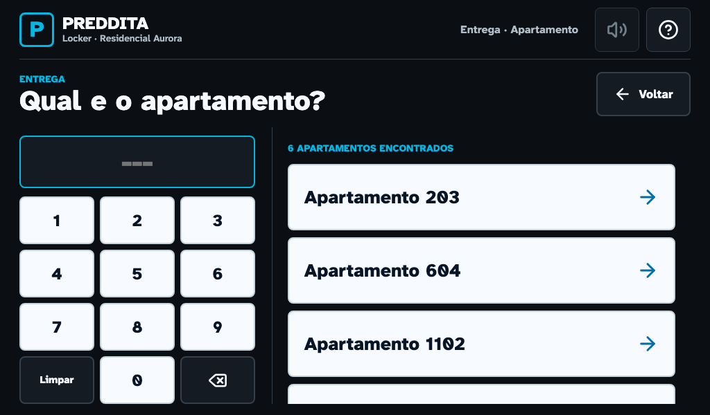

# Jornadas publicas do Kiosk V4

## Objetivo

Esta pagina registra a Parte 3 do plano do Kiosk V4: integracao da linguagem
visual aprovada com as jornadas reais de entrega, retirada e excecao. A
interface mudou; os contratos de seguranca fisica, persistencia e privacidade
continuam sendo as fontes de verdade.

**Base:** produto `2.0.25-lab`, `versionCode 25`, `schemaVersion 12`.

**Viewport de referencia:** `1024x600`, escala `1x`, Chromium headless e
movimento reduzido.

**Status:** implementacao tecnica concluida em 20/07/2026. Validacao no locker
fisico continua obrigatoria antes do piloto.

## O que entrou no fluxo real

- apartamento, confirmacao, porta, espera e sucesso usam o shell full-screen;
- cada tela concentra uma decisao principal e mantem controles com 64 px;
- PIN mascarado e QR formam um controle segmentado;
- leitura QR continua usando `jsQR` e a camera local, sem enviar imagem;
- espera pela porta pequena informa canal, acao e tempo restante;
- fallback grande so ocorre depois da prova de fechamento da porta pequena;
- cancelamento solicitado com porta aberta aguarda o mesmo fechamento antes de
  apagar a reserva;
- retirada exibe sucesso proprio e retorna ao inicio em 10 segundos;
- camera, PIN digitado, IDs ativos e timers sao limpos ao sair da jornada;
- erro e timeout usam um unico dialogo acessivel, com foco e retorno por `Esc`;
- JSX e CSS publicos V3 foram removidos; o Admin Online preserva seu layout.

## Estados e decisoes

| Jornada | Estado | Acao publica |
| --- | --- | --- |
| Entrega | Apartamento | Informar e escolher um destino |
| Entrega | Confirmacao | Corrigir ou abrir a porta pequena |
| Entrega | Porta pequena | Guardar ou pedir porta maior |
| Entrega | Fechamento | Fechar a porta anterior ou solicitar cancelamento |
| Entrega | Porta grande | Guardar e confirmar |
| Entrega | Sucesso | Nova entrega ou inicio |
| Retirada | PIN | Digitar seis numeros; validacao automatica |
| Retirada | QR | Abrir camera e ler o QR PREDDITA |
| Retirada | Porta | Retirar, fechar e confirmar |
| Retirada | Sucesso | Voltar ao inicio; retorno automatico em 10 segundos |
| Excecao | Erro/timeout | Ler a causa, fechar o aviso e tentar novamente |

A navegacao ocorre por estado React. O fluxo publico nao usa
`window.location`, reload ou rota externa para avancar entre etapas.

## Contratos fisicos preservados

1. A porta candidata precisa responder fechada em leitura individual.
2. O acionamento registra um ciclo com canal, placa e leitura de abertura.
3. Deposito e retirada so concluem com prova de fechamento do mesmo canal.
4. A porta grande nao abre enquanto a pequena permanecer aberta.
5. Cancelar durante a espera nao libera a ocupacao ate o sensor confirmar a
   porta pequena fechada.
6. Falha, timeout ou resposta incerta mantem a operacao recuperavel e nao e
   convertido em sucesso visual.

Os testes usam frames RS-485 com BCC pela fixture
`web/e2e/support/kioskTestBridge.js`. Isso prova o contrato da UI com o bridge,
mas nao substitui polaridade, chicote, trava e sensor reais.

## Privacidade

- o PIN permanece mascarado durante a digitacao;
- a camera so inicia por acao explicita e para ao trocar de modo ou sair;
- imagens da camera de QR nao sao persistidas nem enviadas;
- PIN, token, QR e codigo externo sao apagados na conclusao e no cancelamento;
- o E2E recarrega o kiosk e confirma que as credenciais nao reaparecem;
- a tela publica mostra somente o apartamento necessario ao deposito e nao
  exibe nome, contato ou e-mail do morador.

## Referencias visuais

| Ordem | Tela | Referencia |
| --- | --- | --- |
| 1 | Inicio | [01-inicio.png](assets/kiosk-v4-journeys/01-inicio.png) |
| 2 | Apartamento | [02-apartamento.png](assets/kiosk-v4-journeys/02-apartamento.png) |
| 3 | Confirmacao | [03-confirmacao.png](assets/kiosk-v4-journeys/03-confirmacao.png) |
| 4 | Porta pequena | [04-porta-pequena.png](assets/kiosk-v4-journeys/04-porta-pequena.png) |
| 5 | Aguardando fechamento | [05-aguardando-fechamento.png](assets/kiosk-v4-journeys/05-aguardando-fechamento.png) |
| 6 | Porta grande | [06-porta-grande.png](assets/kiosk-v4-journeys/06-porta-grande.png) |
| 7 | Sucesso da entrega | [07-sucesso-entrega.png](assets/kiosk-v4-journeys/07-sucesso-entrega.png) |
| 8 | PIN | [08-pin.png](assets/kiosk-v4-journeys/08-pin.png) |
| 9 | QR | [09-qr.png](assets/kiosk-v4-journeys/09-qr.png) |
| 10 | Porta de retirada | [10-porta-retirada.png](assets/kiosk-v4-journeys/10-porta-retirada.png) |
| 11 | Sucesso da retirada | [11-sucesso-retirada.png](assets/kiosk-v4-journeys/11-sucesso-retirada.png) |
| 12 | Erro recuperavel | [12-erro-recuperavel.png](assets/kiosk-v4-journeys/12-erro-recuperavel.png) |
| 13 | Timeout da porta | [13-timeout-porta.png](assets/kiosk-v4-journeys/13-timeout-porta.png) |



## Cobertura automatizada

| Prova | Arquivo |
| --- | --- |
| Entrega pequena e retirada por PIN no mesmo canal | `web/e2e/kiosk-flow.spec.js` |
| Retirada por QR passando pelo decodificador real | `web/e2e/kiosk-flow.spec.js` |
| Fallback pequena para grande | `web/e2e/kiosk-interactions.spec.js` |
| Cancelamento somente depois de fechar | `web/e2e/kiosk-interactions.spec.js` |
| Timeout sem apagar reserva ativa | `web/e2e/kiosk-interactions.spec.js` |
| Overflow, recorte, sobreposicao, foco e nomes | `web/e2e/kiosk-layout.spec.js` |
| Home, ajuda, contraste e toque | `web/e2e/kiosk-v4-home.spec.js` |

O teste QR gera uma imagem PREDDITA em memoria, simula a camera do navegador e
entrega os pixels ao mesmo `scanQrFromVideo` usado no produto. Nenhum atalho de
estado foi adicionado ao bundle para o teste.

## Metricas do bundle

| Metrica | Baseline V3 | Fundacao V4 | Jornadas V4 |
| --- | ---: | ---: | ---: |
| Bundle sem compressao | `875.327 bytes` | `956.698 bytes` | `953.710 bytes` |
| Bundle gzip | `260.488 bytes` | `320.235 bytes` | `319.470 bytes` |
| Erros de console nas capturas | `0` | `0` | `0` |

Mesmo integrando todas as jornadas, o bundle ficou `2.988 bytes` menor que a
fundacao sem compressao e `765 bytes` menor em gzip. A reducao veio da retirada
do JSX e do CSS publicos V3 duplicados. Dados brutos:
[metrics.json](assets/kiosk-v4-journeys/metrics.json).

## Reproducao

Em `web`, depois de instalar dependencias e Chromium:

```powershell
npm run capture:v4-journeys
npm run test:e2e
```

O primeiro comando recompila o bundle Android, inicia um servidor isolado,
substitui as 13 capturas e grava metricas. Uma nova referencia so deve ser
publicada quando a mudanca for intencional e registrada em `docs/UPDATES.md`.

## Limites desta parte

- audio permanece indisponivel ate a Parte 4;
- a validacao atual usa bridge RS-485 deterministico, nao o locker fisico;
- versao, schema, protocolo, canais e formato persistido nao mudaram;
- os prototipos da Parte 2 continuam como registro da decisao visual, mas as
  telas reais desta pagina sao a referencia operacional atual.
