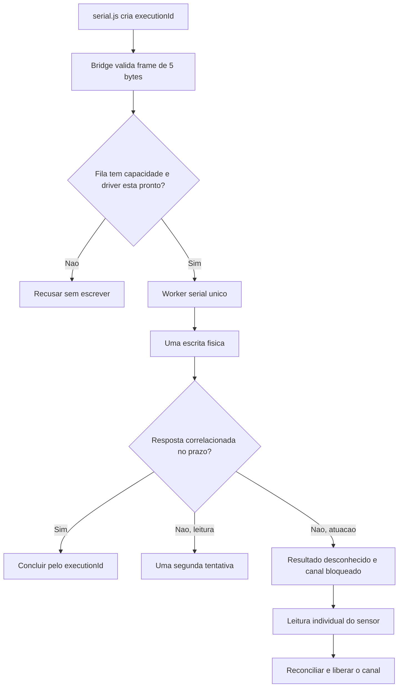

# Kiosk V4 - Resiliencia serial observavel

**Status:** Parte 6 concluida em laboratorio em 21 de julho de 2026. A
validacao no KS1062 continua obrigatoria antes do piloto.

Este documento descreve como o APK coordena o barramento RS-485, quais
operacoes podem ter retry, como uma atuacao incerta e bloqueada e quais
metricas chegam ao Edge Agent e ao console tecnico.

## Resultado entregue

- uma fila nativa limitada a 32 comandos para o unico barramento do locker;
- um worker Java como unico proprietario de `serialOut.write`;
- correlacao por `executionId`, comando, board, canal, tipo de resposta e BCC;
- eco, frame invalido e resposta de outro board/canal incapazes de concluir o
  comando em voo;
- uma segunda tentativa somente para comandos de leitura;
- nenhuma repeticao automatica de comando que possa mover uma trava;
- bloqueio do canal quando a escrita ocorreu, mas a resposta ficou incerta;
- liberacao do bloqueio somente depois de leitura de sensor correlacionada;
- uma tentativa de fechar e reabrir o driver depois de falha de I/O;
- fila fechada para novas operacoes enquanto o driver esta degradado;
- metricas sanitizadas no Edge Agent e no console tecnico;
- testes Java e JavaScript para concorrencia, timeout, ruido, reconexao e
  resultado fisico desconhecido.

## Fluxo nativo



`SerialCommandCoordinator` e uma classe Java sem dependencia de Android. A
`MainActivity` fornece somente tres operacoes de transporte: verificar se a
serial esta disponivel, escrever o frame e tentar recuperar o driver. Isso
permite testar a politica sem abrir uma UART real.

## Contrato WebView

O caminho novo usa:

```text
window.Android.sendRS485Command(executionId, hexFrame)
window.onRS485CommandResult(result)
```

O `executionId` e gerado para cada chamada em `serial.js`, limitado pelo
Android a 80 caracteres alfanumericos, `_` ou `-`. O resultado contem apenas:

- sucesso ou codigo de erro;
- resposta hexadecimal quando houve sucesso;
- tipo `read`, `actuation` ou `configuration`;
- numero de tentativas;
- espera na fila e duracao;
- indicador `executionOutcomeUnknown`.

A bridge antiga `sendRS485(hexFrame)` continua disponivel para compatibilidade,
mas tambem entra no mesmo coordenador. Ela nao cria mais uma thread por escrita.

## Correlacao

Uma resposta so conclui o item em voo quando:

1. o BCC e valido;
2. nao e copia exata do pedido, portanto nao e eco;
3. o comando e o esperado, incluindo `0x9D` para resposta `0x9E`;
4. o board e o mesmo;
5. o canal e o mesmo nas operacoes individuais;
6. o callback pertence ao mesmo `executionId`.

Leitura geral e abertura geral usam respostas agregadas, por isso a correlacao
nao interpreta os bytes de estado empacotado como canal.

## Politica de retry

| Classe | Comandos | Tentativas | Falha final |
| --- | --- | ---: | --- |
| Leitura | `0x80`, `0x82` | ate 2 | erro de timeout ou I/O |
| Atuacao | `0x7A`, `0x7C`, `0x7F`, `0x8A`, `0x9A`, `0x9B`, `0x9D` | 1 | resultado desconhecido e bloqueio de reconciliacao |
| Configuracao | `0x7E`, `0x81`, `0x8D` | 1 | erro sem repeticao automatica |

Alguns controladores KS1062 antigos aplicam `0x7E`, mas nao devolvem ACK. Para
esse comando especifico, um `SERIAL_RESPONSE_TIMEOUT` depois de uma escrita sem
erro e aceito como modo `write-only`; falha de I/O, parada do coordenador ou
qualquer outro erro continuam bloqueantes. Essa compatibilidade nunca se aplica
a comandos de abertura. O fluxo ainda exige leitura fechada antes do `0x8A`,
uma unica atuacao e transicao fisica para aberta antes de prosseguir.

A escrita que lancou uma excecao tambem e tratada como possivelmente parcial.
Para uma atuacao, o app nao tenta adivinhar se nenhum byte, alguns bytes ou o
frame completo chegaram a placa.

### Reconciliacao fisica

Depois de timeout ou falha de I/O em uma atuacao individual, novas atuacoes no
mesmo board/canal recebem `ACTUATION_RECONCILIATION_REQUIRED` antes da UART. Uma
leitura `0x80` individual valida o estado e libera somente esse canal. Uma
leitura geral valida e libera os bloqueios individuais do board. Abertura geral
incerta exige leitura geral.

O fluxo publico ja consulta o sensor depois do comando. Assim, uma resposta
serial perdida pode ser reconciliada pela transicao fisica sem repetir a
abertura. Para comandos remotos, o diario persistente do Edge Agent grava
`commandId`, lease e `executionId` antes da serial; reinicio durante a execucao
continua produzindo resultado desconhecido e bloqueia reexecucao automatica.

## Recuperacao do driver

Em falha de abertura, leitura ou escrita:

1. o coordenador marca o driver como `DEGRADED`;
2. espera 250 ms;
3. fecha streams e interrompe a leitora anterior;
4. procura novamente uma porta da allowlist nativa;
5. aguarda ate 1.800 ms pela reabertura;
6. permite uma nova escrita somente se a operacao era leitura;
7. permanece fechado quando a recuperacao falha.

O botao tecnico `Reconectar serial` continua disponivel para uma tentativa
manual autenticada. Porta, baud rate e comandos de sistema nao sao recebidos da
pagina.

## Observabilidade sanitizada

O estado pode ser `READY`, `BUSY`, `DEGRADED`, `STOPPED` ou `UNAVAILABLE`.
As metricas expostas sao:

- profundidade atual e pico da fila;
- comando em voo, quantidade enviada, concluida e recusada;
- escritas, retries de leitura, timeouts e reaberturas;
- falhas de I/O e atuacoes de resultado desconhecido;
- atuacoes bloqueadas aguardando reconciliacao;
- frames invalidos, respostas nao correlacionadas e bytes descartados;
- ultima espera, maior espera e horario da ultima resposta valida.

O console nao recebe frame bruto, `executionId`, erro interno, stack trace ou
conteudo da fila. A resposta hexadecimal continua atravessando a bridge apenas
para o consumidor que iniciou o comando, pois ela e necessaria para interpretar
o sensor.

## Testes automatizados

```bash
node scripts/v2-serial-protocol-test.mjs
node scripts/serial-native-bridge-test.mjs

output_dir="$(mktemp -d)"
javac -d "$output_dir" \
  android/app/src/main/java/com/preddita/entregaslocker/SerialCommandCoordinator.java \
  scripts/SerialCommandCoordinatorTest.java
java -cp "$output_dir" SerialCommandCoordinatorTest
```

O parser continua testado separadamente com `Rs485FrameParserTest.java`.

Cobertura atual:

- oito submissoes concorrentes com maximo de uma escrita em voo;
- fila limitada recusando excesso sem tocar o transporte;
- board e canal incorretos ignorados;
- eco, fragmentacao, frames colados, ruido e BCC invalido;
- timeout com uma segunda tentativa de leitura;
- timeout de atuacao sem segunda escrita;
- bloqueio do canal e liberacao por leitura individual;
- falha de I/O, uma reabertura e retry somente da leitura;
- recuperacao falha deixando driver e fila degradados;
- contrato JavaScript do callback por `executionId`;
- diario persistente bloqueando reexecucao remota depois de restart;
- prova fechada-aberta-fechada nas polaridades `zeroOpen` e `zeroClosed`.

## Gate de bancada

Antes do piloto, executar no KS1062 com um canal de teste isolado:

- [ ] confirmar build e inicializacao do bridge `PREDDITA-BRIDGE-1.8.0`;
- [ ] gerar leituras concorrentes e confirmar, por log ou analisador, que nao
  existem escritas sobrepostas;
- [ ] injetar ruido e um frame de outro board/canal sem concluir a solicitacao;
- [ ] interromper uma leitura e observar exatamente um retry;
- [ ] interromper a resposta de abertura e confirmar uma unica escrita;
- [ ] tentar abrir novamente e observar o bloqueio ate a leitura do sensor;
- [ ] desconectar a UART durante leitura, confirmar uma reabertura e estado
  `DEGRADED` quando a porta nao volta;
- [ ] repetir o ciclo fechada-aberta-fechada em `zeroOpen`;
- [ ] repetir o ciclo fechada-aberta-fechada em `zeroClosed`;
- [ ] reiniciar o app entre escrita e resposta de comando remoto e confirmar
  que o diario nao reexecuta a atuacao;
- [ ] conferir que console e heartbeat nao exibem payload nem identificador de
  execucao.

## Limites conhecidos

- Os bloqueios nativos de reconciliacao vivem no processo Android. A protecao
  entre reinicios para comandos remotos pertence ao diario persistente do Edge
  Agent.
- O teste automatizado prova exclusao mutua no transporte simulado; eletrica,
  temporizacao, polaridade e comportamento da CM06 exigem bancada.
- A Parte 6 nao altera firmware, baud rate, pinagem, mapa comissionado ou
  `schemaVersion`.

## Arquivos principais

- `android/app/src/main/java/com/preddita/entregaslocker/SerialCommandCoordinator.java`
- `android/app/src/main/java/com/preddita/entregaslocker/Rs485FrameParser.java`
- `android/app/src/main/java/com/preddita/entregaslocker/MainActivity.java`
- `web/src/serial.js`
- `web/src/edgeAgent.js`
- `web/src/diagnosticBridge.js`
- `web/src/DiagnosticsView.jsx`
- `scripts/SerialCommandCoordinatorTest.java`
- `scripts/serial-native-bridge-test.mjs`
