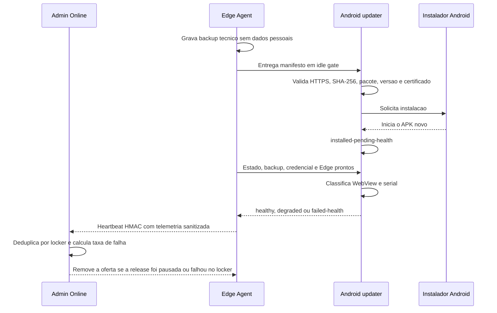

# Kiosk V4 - saude e recuperacao de update

Esta pagina descreve a Parte 7 do Kiosk V4: separar APK instalado de versao
realmente pronta, interromper uma release ruim e orientar recuperacao sem abrir
shell remoto, aceitar downgrade ou enfraquecer a assinatura Android.

## Resultado de laboratorio

O atualizador agora usa quatro estados posteriores ao instalador:

| Estado | Significado | Efeito no rollout |
| --- | --- | --- |
| `installed-pending-health` | APK novo iniciou, mas os sinais ainda estao incompletos | Aguarda por ate 3 minutos |
| `healthy` | Runtime, configuracao, credencial e serial estao prontos | Release permanece valida |
| `degraded` | App esta operante, mas a serial foi classificada com falha | Exige suporte; nao conta como falha de startup |
| `failed-health` | Startup, estado, backup, credencial ou janela falhou | Mesma release nao e oferecida e pode pausar o rollout |

`downloading`, `downloaded`, `installing` e `up-to-date` continuam existindo.
Assim, o Admin diferencia transporte, instalacao e saude da versao instalada.

## Fluxo

## Sinais e prazos

O Android persiste os sinais em `SharedPreferences`, portanto um restart nao
transforma uma validacao incompleta em sucesso. Cada processo precisa confirmar:

- app iniciado;
- pagina restrita da WebView carregada;
- Edge Agent ativo;
- estado local carregado;
- backup de configuracao lido e compativel;
- credencial HMAC provisionada;
- serial classificada como saudavel ou degradada.

O timeout de startup e de 45 segundos. A janela completa e de 3 minutos para
permitir inicializacao da UART. Falha serial conhecida gera `degraded`; serial
sem classificacao ate o fim da janela gera `failed-health`. O Android tambem
agenda a avaliacao local, sem depender de uma tela tecnica aberta.

## Backup minimo

Antes de entregar o manifesto ao bridge, `appUpdateHealth.js` grava somente:

- identificadores tecnicos de tenant e locker;
- board, quantidade de portas e polaridade;
- tempo de acionamento e mapa de tamanhos;
- status e data do comissionamento;
- release e `versionCode` de destino.

Moradores, contatos, entregas, PIN, token, QR, codigo externo, foto e OCR nao
entram nesse registro. O primeiro boot compara a configuracao carregada com o
backup exato; schema desconhecido, JSON ilegivel, release divergente ou
configuracao alterada falham de modo fechado.

## Pausa automatica

O Admin Geral configura:

- pausa automatica ligada ou desligada;
- percentual maximo de falhas, entre 1 e 100.

Cada locker conta uma vez por release; novo heartbeat atualiza a mesma amostra.
Como a politica atual e persistida por locker, a amostra minima e fixada em um:
um `failed-health` representa 100% naquele escopo e pausa novas ofertas desse
locker. Somente `failed-health` entra na taxa; `degraded` aparece separado para
suporte. O servidor preserva o relatorio e registra `app-update-auto-paused` na
auditoria. Lockers que ja reportaram `healthy` nao sao invalidados.

Uma release nova, identificada por outro `releaseId` ou `versionCode`, inicia
uma amostragem limpa. O painel mostra versao, estado, sinais, causa, prazo, taxa
e acao recomendada.

## Recuperacao segura

1. Mantenha a distribuicao pausada e identifique o codigo estavel no Admin.
2. Preserve o estado e o backup antes de qualquer intervencao.
3. Para defeito do app, gere um APK corrigido com `versionCode` superior,
   mesmo `applicationId` e a mesma chave de assinatura.
4. Para configuracao ou credencial, use o fluxo local autenticado, ADB em janela
   controlada ou MDM aprovado; nao envie comandos arbitrarios pelo Admin.
5. Revalide hash e certificado antes da instalacao e repita o health check.
6. Reative o rollout gradualmente somente depois de evidencia no equipamento.

Nao existe downgrade automatico. Android pode recusar um `versionCode` menor,
e contornar essa protecao criaria risco de assinatura e perda de dados.

## Seguranca preservada

- URL inicial e redirecionamentos continuam obrigatoriamente em HTTPS.
- SHA-256 e comparado em tempo constante.
- Pacote, `versionName`, `versionCode` e certificado precisam corresponder.
- O APK deve ser uma versao superior; downgrade continua recusado.
- O idle gate impede install durante jornada ou comando remoto.
- O servidor nao executa shell, script ou caminho enviado pelo painel.

## Validacao automatizada

- `AppUpdateHealthContractTest.java`: sucesso, serial degradada, app que nao
  inicia, backup incompativel e timeout completo.
- `app-update-health-test.mjs`: backup valido, ausencia de PII e leitura
  corrompida/incompativel.
- `v2-edge-agent-contract-test.mjs`: backup anterior ao handoff e sinais do
  primeiro boot.
- `v2-smoke-test.mjs`: ingestao do health, causa, pausa automatica e bloqueio da
  mesma release.
- build Vite e contratos Java preservam as verificacoes anteriores.

## Gate fisico restante

A implementacao esta concluida em laboratorio. A Parte 8 ainda precisa usar um
APK assinado superior no KS1062 para observar install real, kill/restart do
processo, UART ausente, queda de energia, recuperacao ADB/MDM e pausa de um
rollout piloto. Ate isso ocorrer, o canal permanece `lab`.
