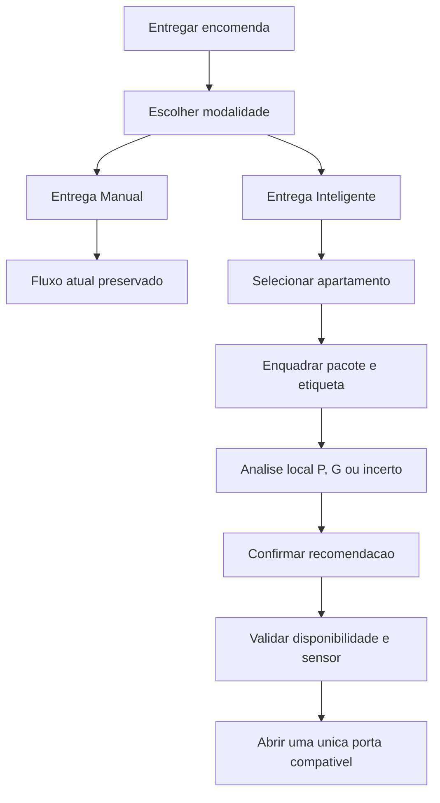

# Plano de desenvolvimento da Entrega Inteligente

## Objetivo

Adicionar uma segunda jornada de deposito sem alterar o comportamento da
entrega atual. Ao tocar em `Entregar encomenda`, o entregador escolhe:

- `Entrega Manual`: mantem a abertura inicial de uma porta pequena e o fallback
  fisicamente seguro para uma porta grande;
- `Entrega Inteligente`: captura o pacote, executa analise local e recomenda
  uma porta `P` ou `G` antes de qualquer acionamento.

**Base:** produto `2.0.33-lab`, `versionCode 33`, `schemaVersion 13`.

## Fluxo de produto

## Regras que nao podem ser enfraquecidas

1. Resultado incerto nunca autoriza abertura.
2. Pacote classificado como `G` nunca recebe porta `P`.
3. Falha de camera, modelo ou timeout oferece retorno ao modo manual sem criar
   reserva.
4. Abertura continua exigindo leitura individual de porta fechada.
5. Deposito continua exigindo prova de fechamento do mesmo canal.
6. Imagem anterior a uma entrega cancelada e apagada imediatamente.
7. O modelo roda localmente e nao depende de internet.

## Etapas

| Parte | Entrega | Status |
| --- | --- | --- |
| 1 | Contrato `manual/smart` e resultado `P/G/incerto` | Concluida em 22/07/2026 |
| 2 | Tela de escolha e regressao integral da Entrega Manual | Concluida em 22/07/2026 |
| 3 | Captura guiada, estabilidade, foco e melhor frame | Concluida em 22/07/2026 |
| 4 | Bridge Android e analisador local offline | Concluida em 22/07/2026 |
| 5 | Dataset controlado, treinamento e calibracao P/G | Em andamento: pipeline concluido em 22/07/2026; coleta e modelo pendentes |
| 6 | Recomendacao, confirmacao e alocacao segura | Concluida tecnicamente em 22/07/2026; modelo real continua bloqueado pela Parte 5 |
| 7 | Dados minimos, privacidade, metricas e diagnostico | Concluida tecnicamente em 22/07/2026 |
| 8 | Modo sombra, piloto fisico e rollout gradual | Pendente |

## Partes 1 a 4 implementadas

- `CourierModeStep` exibe as duas modalidades antes do apartamento.
- `Entrega Manual` entra no mesmo fluxo de negocio existente.
- `Entrega Inteligente` avanca ate a captura guiada. No app real, a ausencia do
  modelo aprovado ainda impede classificacao, reserva ou abertura de porta.
- Voltar do apartamento retorna a modalidade; voltar da modalidade encerra a
  jornada e retorna ao inicio.
- `Nova entrega` tambem retorna a escolha de modalidade.
- `smartDelivery.js` normaliza modo, status, tamanho, confianca, qualidade,
  versao do modelo e tempo de inferencia.
- `canOpenDoorFromPackageAnalysis` recusa estado incerto, tamanho diferente de
  `P/G` e confianca abaixo de `0,90`.
- A camera so abre por acao explicita na tela `Mostre o pacote`.
- Cada quadro e avaliado localmente por iluminacao, contraste, nitidez e
  movimento em uma amostra `96x54`.
- A captura automatica exige aproximadamente tres segundos continuos de
  qualidade aceitavel e preserva o melhor quadro desse intervalo.
- Cancelar, voltar, refazer ou migrar para Entrega Manual encerra o stream e
  limpa a captura.
- Falha de camera ou processamento permanece recuperavel e oferece a jornada
  manual sem criar entrega.
- `PredditaPackageAnalyzer` executa fora da thread principal e nao expoe
  nenhum metodo de porta ou serial.
- `packageAnalyzer.js` aplica timeout de cinco segundos, correlacao por
  `requestId` e validacao defensiva do resultado.
- JPEG, tamanho do payload, dimensoes e quantidade de pixels possuem limites
  antes da inferencia.
- O modelo so podera ser carregado quando o SHA-256 coincidir com o valor
  aprovado no aplicativo.
- Como o dataset ainda nao existe, o estado atual e propositalmente
  `uncertain/model-not-installed`; a interface orienta usar o modo manual.

## Infraestrutura da Parte 5 implementada

- O rotulo de referencia passa a ser derivado das medidas reais do pacote e
  das dimensoes uteis das portas, considerando rotacao e folga minima.
- Pacotes na fronteira de encaixe ou maiores que a porta `G` recebem
  `uncertain`; eles nao sao forçados para uma classe operacional.
- O manifesto exige SHA-256 da imagem, qualidade aceita, revisao de privacidade
  e ausencia de dados pessoais visiveis.
- A separacao `train/validation/test` e deterministica e ocorre por
  `packageId`; vistas do mesmo volume nunca atravessam os grupos.
- Os limiares sao escolhidos somente na validacao. O teste intocado apenas
  aprova ou reprova o candidato.
- Um `G` classificado como `P` reprova o relatorio com o gate padrao de falso
  `P` igual a zero.
- Fotos e artefatos locais de treinamento ficam fora do Git por padrao.
- O procedimento completo esta em
  [Dataset e calibracao da Entrega Inteligente](DATASET-CALIBRACAO-ENTREGA-INTELIGENTE.md).

## Parte 6 implementada

- Resultado decisivo exige status `ready`, tamanho `P/G`, confianca minima,
  versao e SHA-256 validos e identidade igual a informada por `getInfo()`.
- A recomendacao expira dois minutos depois da captura.
- Uma tela separada mostra porta recomendada, apartamento e confirmacao
  explicita; ate o toque final nao existe reserva nem comando RS-485.
- A foto e apagada da memoria antes de criar a reserva e nao entra na entrega
  armazenada, no evento de auditoria ou na notificacao.
- `P` pesquisa somente o catalogo pequeno e `G` somente o catalogo grande. Nao
  existe promocao ou reducao silenciosa entre tamanhos.
- A porta candidata precisa responder fechada em leitura individual antes da
  reserva e repete o ciclo fisico de abertura e fechamento ja usado no modo
  manual.
- Falha de sensor ou falta da porta recomendada preserva zero comandos e zero
  reservas.
- Os caminhos decisivos usam apenas a bridge simulada no E2E. O Android real
  continua em `uncertain/model-not-installed` ate a Parte 5 ser aprovada.

## Parte 7 implementada

- O armario mantem um diario local exclusivo da Entrega Inteligente, limitado
  a 100 eventos e sete dias, com limpeza manual no console tecnico.
- Os eventos usam allowlists fechadas para acao, resultado, tamanho, faixa de
  qualidade, motivo e versao do modelo. Tempo de inferencia e arredondado em
  intervalos de 10 ms.
- Foto, apartamento, pessoa, PIN, QR, porta, etiqueta, codigo externo e textos
  livres nao pertencem ao contrato e nao sao persistidos.
- A aba `Inteligente` mostra disponibilidade, versao e prefixo do checksum do
  modelo, contagens P/G, resultados inconclusivos, confirmacoes, aberturas e
  p95 de inferencia.
- A metrica de jornada enviada pelo Edge Agent passou ao schema `2` e informa
  modalidade, resultado P/G ou inconclusivo, confirmacao e resultado da porta.
- O Admin Online normaliza novamente os campos recebidos, conserva no maximo
  500 amostras por 30 dias e exibe somente agregados sanitizados.
- Testes puros e E2E comprovam retencao, limites, limpeza, integracao do fluxo e
  ausencia de imagem, apartamento e porta nos eventos.

## Pendencias para concluir a Parte 5

A infraestrutura nao substitui evidencia real. Para concluir a Parte 5 ainda e
necessario:

1. medir as dimensoes internas uteis das portas `P` e `G`;
2. definir criterios de rotulagem e uma zona cinzenta obrigatoriamente
   classificada como `incerto`;
3. coletar imagens autorizadas em diferentes iluminacoes, angulos e embalagens;
4. validar o manifesto e gerar o split sem repetir o mesmo pacote entre grupos;
5. treinar e converter o modelo para execucao offline no Android;
6. gerar scores de validacao e teste e executar a calibracao automatica;
7. registrar versao, SHA-256, entradas, saidas e metricas por classe;
8. preencher o checksum aprovado somente depois dos gates de precisao e
   falsos `P` serem atendidos.

## Gate para habilitar Entrega Inteligente

- dimensoes internas uteis das portas `P` e `G` registradas;
- camera e tempo de inferencia medidos no Android real;
- modelo empacotado e disponivel offline;
- resultado `P` com precisao minima aprovada no conjunto de validacao;
- teste de baixa confianca, indisponibilidade e cancelamento;
- modo sombra concluido antes de a recomendacao influenciar a porta.

## Cobertura atual

- contrato puro em `scripts/smart-delivery-test.mjs`;
- qualidade de imagem sintetica em `scripts/package-capture-quality-test.mjs`;
- contrato da bridge em `scripts/package-analyzer-bridge-test.mjs` e
  `scripts/PackageAnalysisContractTest.java`;
- rotulagem dimensional, privacidade do manifesto, split por pacote e
  calibracao segura em `scripts/package-dataset-calibration-test.mjs`;
- captura automatica com camera simulada, encerramento do stream e prova de
  zero comandos de abertura em `web/e2e/kiosk-flow.spec.js`;
- recomendacoes simuladas `P/G`, revisao humana, catalogo exato, ausencia de
  reserva antecipada, descarte da foto e falha segura sem fallback em
  `web/e2e/kiosk-flow.spec.js`;
- telemetria sanitizada, retencao local e remota, resumo tecnico e limpeza em
  `scripts/smart-delivery-telemetry-test.mjs`, `scripts/pilot-metrics-test.mjs`
  e `web/e2e/kiosk-diagnostics.spec.js`;
- jornada manual, QR, fallback, cancelamento e timeout em Playwright;
- layout sem overflow ou sobreposicao em `1024x600`, `1280x800`, `800x480` e
  `390x844`;
- build Vite do mesmo bundle copiado para os assets Android.
