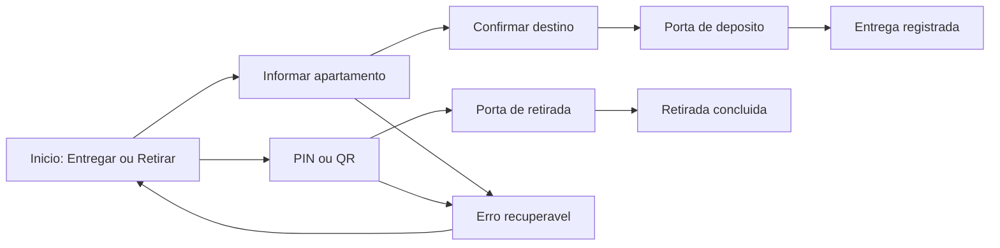
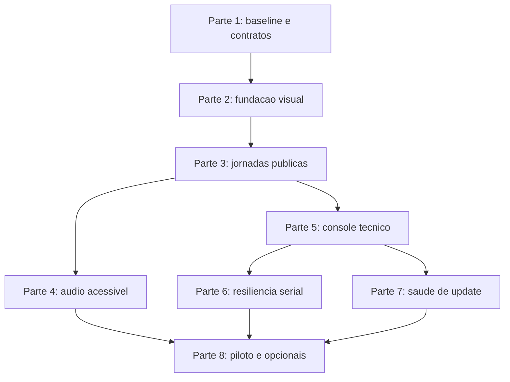

# Plano de implementacao das melhorias e do redesign do kiosk

## Objetivo

Este plano transforma os aprendizados da analise do app recuperado em uma
sequencia executavel para o PREDDITA Locker. Ele cobre:

- redesign original do frontend publico, inspirado na clareza visual observada;
- orientacao sonora acessivel;
- console tecnico mais completo;
- resiliencia do barramento serial;
- health checks seguros depois de atualizacoes;
- recursos condicionais que dependem de piloto e aprovacao de privacidade.

**Base:** produto `2.0.25-lab`, `versionCode 25`, `schemaVersion 12`.

O plano possui oito partes. As partes 1 a 7 formam o ciclo principal. A parte
8 so comeca depois de evidencias do piloto e decisoes de produto.

## Decisoes de direcao

1. A experiencia publica sera redesenhada; regras de porta, Edge Agent,
   idempotencia, HMAC, Keystore e Postgres permanecem como fundacao.
2. O visual sera inspirado em principios observados, nao em assets ou codigo do
   outro produto.
3. O kiosk sera expressivo e simples; o Admin Online continuara denso,
   utilitario e orientado a operacao.
4. A primeira resolucao de aceite continua sendo `1024x600` em landscape, que
   corresponde ao painel validado. Outras resolucoes entram na regressao.
5. Nenhuma nova funcao fisica sera considerada concluida apenas por mudanca de
   tela. A prova fechada-aberta-fechada continua obrigatoria.
6. Voz, camera e integracoes nunca podem expor nome, unidade, PIN, QR ou outro
   dado pessoal em area comum ou em logs.
7. Nao sera criado terminal remoto generico, atualizador com shell ou Node-RED
   privilegiado.

## O que sera aproveitado do visual observado

O app analisado usa fundo preto, superficies brancas, tipografia muito grande,
botoes amplos, teclado embutido e uma acao por tela. Esses principios funcionam
bem em autoatendimento e serao reinterpretados para a PREDDITA.

Sera aproveitado:

- contraste alto e leitura a distancia;
- composicao full-screen, sem moldura de dashboard no fluxo publico;
- hierarquia baseada em acao principal, e nao em muitos cards;
- numero da porta como elemento dominante;
- teclado numerico grande e estavel;
- retorno, ajuda e audio como controles secundarios discretos;
- confirmacao visual imediata para toque, espera, sucesso e erro;
- transicoes curtas entre estados, sem recarregar a pagina.

Nao sera copiado:

- logo, nome, imagens, audios, rotas, textos ou arquivos do outro produto;
- desenho exato de botoes, curvas, tipografia ou posicionamento;
- credenciais de entregador no navegador;
- navegacao por `window.location` ou WebSocket sem reconexao;
- tamanhos em `vw` que prejudicam previsibilidade;
- paginas duplicadas para cada variante de fluxo.

## Direcao visual PREDDITA Kiosk V4

### Identidade

O conceito sera **alto contraste operacional**:

| Papel | Direcao |
| --- | --- |
| Fundo principal | Carvao quase preto, uniforme e sem gradiente |
| Superficie de acao | Branco levemente frio |
| Marca e foco | Ciano PREDDITA |
| Atencao | Amarelo quente |
| Sucesso | Verde |
| Erro ou risco | Vermelho |
| Texto no escuro | Branco |
| Texto na superficie | Preto profundo |

Os valores finais serao definidos como tokens CSS e validados por contraste.
A interface nao sera monocromatica: ciano identifica progresso e foco; amarelo,
verde e vermelho ficam reservados para estados semanticos.

### Forma e tipografia

- Manter a identidade tipografica PREDDITA ou adotar fonte aberta empacotada
  localmente, com arquivo de licenca no repositorio.
- Nao carregar Google Fonts ou qualquer fonte em runtime.
- Usar tamanhos fixos por breakpoint; nao escalar fonte com largura de viewport.
- Botoes publicos com alvo minimo de 64 px e teclado com celulas estaveis.
- Bordas retas ou raio de ate 8 px; arredondamento nao sera o principal recurso
  visual.
- Usar icones Lucide em comandos familiares. Remover SVG manual onde houver
  equivalente.
- Animacoes entre 120 e 220 ms, somente para feedback de estado, respeitando
  `prefers-reduced-motion`.

### Estrutura das telas

O fluxo publico nao usara o shell translucido e a composicao de cards da V3.
Cada tela ocupara o viewport inteiro com tres zonas estaveis:

1. **Barra superior:** marca PREDDITA, etapa atual, audio e ajuda.
2. **Area principal:** uma pergunta ou estado dominante.
3. **Barra de acao:** comando principal e, quando necessario, uma alternativa.

Nao havera cards dentro de cards, fundo com orbs, grade decorativa ou texto de
marketing. A tela deve parecer um equipamento de autoatendimento.

## Mapa da experiencia publica

### Inicio

- Marca PREDDITA como primeiro sinal visual.
- Duas grandes areas de acao: `Entregar encomenda` e `Retirar encomenda`.
- Icones de pacote e retirada, sem ilustracao proprietaria.
- Ajuda e audio em botoes de icone na barra superior.
- Estado tecnico nao aparece para o publico; indisponibilidade vira mensagem
  simples e bloqueia o fluxo de forma segura.

### Entrega

- Teclado numerico 3x4 com dimensoes fixas.
- Apartamentos encontrados em lista curta, mostrando somente o necessario.
- Confirmacao em uma tela propria antes de acionar a porta.
- Politica atual de alocacao preservada durante o redesign.
- Se a encomenda nao couber, a troca de tamanho so ocorre depois da prova de
  fechamento da porta anterior.
- Porta aberta exibe o numero em escala dominante e instrucao curta.
- Sucesso oferece `Nova entrega` e `Inicio`, com retorno automatico apenas
  quando nao houver credencial que o entregador precise anotar.

### Retirada

- PIN como modo principal, com validacao automatica ao completar seis digitos.
- QR como aba secundaria por controle segmentado.
- Digitos mascarados quando a politica de privacidade exigir.
- Numero da porta domina a tela de abertura.
- Conclusao somente depois da leitura individual de fechamento.

### Espera, erro e cancelamento

- Estado de espera deve explicar a acao atual sem spinner solto.
- Erros usam linguagem recuperavel: o que aconteceu e qual acao esta
  disponivel.
- Timeout limpa credenciais temporarias, camera, audio e estado da jornada.
- Cancelamento durante porta aberta orienta fechamento e nao abandona a prova
  fisica.

## Arquitetura de frontend proposta

O redesign continua usando React 18 e CSS, sem introduzir um framework de UI.

Arquivos previstos:

| Arquivo | Responsabilidade |
| --- | --- |
| `web/src/publicKioskUi.jsx` | Componentes publicos sem side effects |
| `web/src/publicKioskCopy.js` | Textos e nomes de estados publicos |
| `web/src/touchFlow.js` | Apresentadores e regras testaveis da jornada |
| `web/src/kioskTheme.css` | Tokens e layout exclusivo do Kiosk V4 |
| `web/src/kioskIcons.jsx` | Adaptadores de icones Lucide usados no kiosk |
| `web/src/audioGuidance.js` | Mapa de estados para prompts e controle de reproducao |
| `web/src/App.jsx` | Estado e handlers; nao recebe regras visuais duplicadas |
| `web/e2e/kiosk-flow.spec.js` | Jornada fisica e regressao visual |
| `web/e2e/kiosk-layout.spec.js` | Viewports, overflow, foco e sobreposicao |

`app.css` sera reduzido gradualmente. Estilos publicos V4 ficam isolados em
`kioskTheme.css`; estilos administrativos existentes nao devem herdar o tema
expressivo do kiosk.

## Ordem de implementacao

## Estimativa de execucao

Estimativa para uma pessoa, com ambiente pronto. E uma referencia de capacidade,
nao um prazo contratual; disponibilidade do locker e resultados de bancada
podem alterar as partes 6 a 8.

| Parte | Faixa estimada | Dependencia principal |
| --- | --- | --- |
| 1. Baseline e contratos | 1 a 2 dias | Playwright e build atual |
| 2. Fundacao visual e home | 2 a 4 dias | Aprovacao do conceito visual |
| 3. Jornadas publicas | 4 a 7 dias | Partes 1 e 2 |
| 4. Audio acessivel | 2 a 4 dias | Jornada visual estavel |
| 5. Console tecnico | 4 a 7 dias | Bridge e modelo de permissao |
| 6. Resiliencia serial | 5 a 8 dias | Bancada e hardware disponiveis |
| 7. Saude de update | 4 a 7 dias | APK assinado e rollout de laboratorio |
| 8. Piloto | 5 a 10 dias corridos | Locker comissionado e usuarios de teste |

O ciclo principal representa aproximadamente 22 a 39 dias de engenharia, alem
das janelas de observacao do piloto. As partes podem ser entregues e avaliadas
individualmente; nao e necessario esperar o ciclo inteiro para testar a nova
home.

## Parte 1 - Baseline, contratos e protecao contra regressao

**Objetivo:** medir a V3 antes da mudanca e criar testes que permitam alterar o
visual sem perder comportamento.

Tarefas:

- [x] Capturar screenshots atuais de inicio, apartamento, confirmacao, porta,
  sucesso, PIN, QR, erro e timeout.
- [x] Adicionar projetos Playwright para `1024x600`, `1280x800`, `800x480` e
  `390x844`.
- [x] Criar teste de layout que detecta overflow externo, botoes fora do
  viewport, texto cortado e sobreposicao dos controles principais.
- [x] Cobrir teclado, retorno, cancelamento, timeout e `Nova entrega` no E2E.
- [x] Adicionar verificacao de foco visivel e nomes acessiveis dos controles.
- [x] Registrar metricas iniciais de bundle, tempo de primeira tela e erros do
  console.
- [x] Preservar o APK `2.0.25-lab` como rollback do piloto.

Criterios de aceite:

- Jornada atual passa nos quatro viewports.
- O teste falha deliberadamente quando um controle e movido para fora da tela.
- Screenshot, video e trace continuam restritos a falhas no CI.
- Nenhuma regra de porta ou versao do produto muda nesta parte.

**Esforco relativo:** pequeno.

**Status em 20/07/2026:** concluida. Evidencias, metricas e procedimento de
reproducao estao em [KIOSK-V3-BASELINE.md](KIOSK-V3-BASELINE.md).

## Parte 2 - Fundacao visual e tela inicial V4

**Objetivo:** criar a linguagem visual original e substituir primeiro a home,
sem tocar na regra de entrega ou retirada.

Tarefas:

- [x] Criar `kioskTheme.css` com tokens de cor, espacamento, dimensoes, foco e
  movimento reduzido.
- [x] Remover gradientes, vidro, grade decorativa e moldura arredondada apenas
  do fluxo publico.
- [x] Adicionar `lucide-react`, conferir licenca e auditoria, e substituir os
  SVGs manuais da home.
- [x] Implementar barra superior com marca, audio e ajuda.
- [x] Implementar duas areas principais de acao com altura e largura estaveis.
- [x] Montar prototipos navegaveis com dados ficticios para inicio, apartamento,
  porta aberta, PIN e sucesso antes de substituir o fluxo de producao.
- [x] Criar estados `pressed`, `focus-visible`, `disabled`, `loading` e
  `unavailable`.
- [x] Garantir que o logo e a fonte funcionem totalmente offline.
- [x] Criar screenshots de referencia da home nos quatro viewports.

Criterios de aceite:

- Home cabe em `1024x600` sem scroll.
- Cada acao possui alvo minimo de 64 px e feedback de toque em ate 100 ms.
- Contraste atende WCAG AA: 4,5:1 para texto normal e 3:1 para texto grande.
- Layout nao muda de tamanho ao pressionar, carregar ou desabilitar um botao.
- Marca e assets nao dependem de rede.
- Workflow e build existentes continuam passando.
- Responsavel do produto aprova as cinco telas de referencia em `1024x600`
  antes do inicio da Parte 3.

**Esforco relativo:** medio.

**Status em 20/07/2026:** concluida e aprovada pelo responsavel do produto. A
home V4 entrou no fluxo real e as cinco referencias orientaram a integracao da
Parte 3. Referencias, metricas, licencas e reproducao estao em
[KIOSK-V4-FUNDACAO-VISUAL.md](KIOSK-V4-FUNDACAO-VISUAL.md).

## Parte 3 - Redesign completo das jornadas publicas

**Objetivo:** aplicar o sistema visual a entrega, retirada e estados
excepcionais, mantendo os contratos fisicos atuais.

Tarefas:

- [x] Refatorar `publicKioskUi.jsx` em componentes de tela, teclado, barra de
  acao e estado de porta reutilizaveis.
- [x] Remover JSX publico legado ainda duplicado em `App.jsx`.
- [x] Aplicar uma decisao por tela em apartamento, confirmacao, porta e sucesso.
- [x] Transformar PIN e QR em modos de um controle segmentado.
- [x] Criar tela de espera com mensagem contextual e sem mudanca de layout.
- [x] Criar componentes unicos para erro, timeout, indisponibilidade e
  cancelamento seguro.
- [x] Implementar retorno automatico com limpeza de camera, timers e estado.
- [x] Proibir `window.location` e reload como mecanismo de navegacao.
- [x] Garantir que nomes, contatos e credenciais nao aparecam fora do momento
  estritamente necessario.
- [x] Atualizar screenshots e E2E da jornada completa.

Criterios de aceite:

- Entrega pequena, fallback para porta maior, retirada por PIN e retirada por
  QR passam no E2E.
- A mesma porta e validada nas provas de abertura e fechamento.
- PIN, token, QR e codigo externo permanecem apagados depois da conclusao e do
  reload.
- Nenhuma tela publica possui scroll externo em `1024x600`.
- Textos e botoes nao se sobrepoem nos quatro viewports.
- Nao existe card dentro de card no fluxo publico.
- Usuario consegue retornar ou cancelar sem deixar porta aberta sem orientacao.

**Esforco relativo:** grande.

**Status em 20/07/2026:** implementacao tecnica concluida. Entrega pequena,
fallback grande, retirada por PIN/QR, cancelamento seguro, timeout, quatro
viewports e limpeza de credenciais estao cobertos. Evidencias, metricas e
reproducao estao em
[KIOSK-V4-JORNADAS-PUBLICAS.md](KIOSK-V4-JORNADAS-PUBLICAS.md). A validacao em
hardware real permanece como gate do piloto.

## Parte 4 - Orientacao sonora e acessibilidade

**Objetivo:** adicionar audio util sem expor dados pessoais nem acoplar voz ao
hardware.

Primeira entrega usara prompts fixos empacotados. TTS dinamico fica fora do
primeiro ciclo para reduzir variacao, latencia e risco de falar dados pessoais.

Tarefas:

- [x] Criar `audioGuidance.js` com estados permitidos e politica de prioridade.
- [x] Gravar ou gerar prompts PREDDITA originais para inicio, escolha,
  confirmacao, porta, fechamento, sucesso, cancelamento e erro.
- [x] Empacotar audios localmente com origem e estado de distribuicao registrados.
- [x] Reproduzir cada prompt uma vez por transicao, nunca por rerender.
- [x] Adicionar botao de audio e estado mudo sem texto dentro do botao, com
  tooltip e nome acessivel.
- [x] Persistir somente preferencia de volume/mudo, sem identidade de usuario.
- [x] Interromper audio ao mudar de etapa, cancelar ou retornar ao inicio.
- [x] Nao falar nome, apartamento, bloco, porta, PIN ou QR em area comum.
- [x] Avaliar integracao de volume ao bridge Android; o hardware atual nao a
  exige e a superficie nativa permaneceu inalterada.

Criterios de aceite:

- O fluxo inteiro funciona com audio desligado.
- Nenhum prompt e repetido por atualizacao de estado da mesma tela.
- Nao ha chamada de rede para TTS.
- `prefers-reduced-motion`, foco por teclado e leitores de tela continuam
  funcionais.
- Testes confirmam a lista fechada de prompts e a ausencia de dados pessoais.

**Esforco relativo:** medio.

**Status em 20/07/2026:** implementacao de laboratorio concluida. Doze prompts
locais, politica fechada, controle acessivel, persistencia minima, quatro
viewports e verificacao de privacidade estao cobertos. Evidencias e limites de
distribuicao estao em
[KIOSK-V4-AUDIO-ACESSIVEL.md](KIOSK-V4-AUDIO-ACESSIVEL.md). Inteligibilidade,
volume e direitos dos arquivos atuais permanecem como gates do piloto.

## Parte 5 - Console tecnico e diagnostico de campo

**Objetivo:** reunir suporte local em uma interface autenticada, sem terminal
remoto nem comandos arbitrarios.

Escopo inicial:

- serial: porta, baud rate, ultimo frame valido, ultimo erro e reconexoes;
- portas: comissionamento, estado e teste individual protegido;
- rede: conectividade, ultimo sync e latencia, inicialmente somente leitura;
- camera: permissao, disponibilidade e preview local temporario;
- tela: brilho e volume por controles limitados;
- armazenamento: espaco livre e tamanho dos diarios;
- update: versao atual, alvo, progresso, erro e health check;
- Edge Agent: heartbeat, fila, MQTT e Admin Online.

Tarefas:

- [x] Remover o fallback permissivo do modo diagnostico quando nao existe PIN.
- [x] Exigir credencial tecnica provisionada e registrar abertura/fechamento da
  sessao de diagnostico.
- [x] Reorganizar `DiagnosticsView` em abas de status, portas, conectividade,
  camera, tela e update.
- [x] Usar controles nativos adequados: sliders para brilho/volume, toggles
  para opcoes binarias e icones para comandos familiares.
- [x] Criar bridge Android com allowlist estrita para leitura e ajustes
  numericos; nunca aceitar shell, caminho ou comando informado pela UI.
- [x] Auditar todo teste de porta e ajuste persistente.
- [x] Aplicar timeout curto da sessao tecnica e retorno seguro ao kiosk.
- [x] Exibir erro sanitizado para o tecnico e detalhe completo apenas nos logs
  protegidos.

Criterios de aceite:

- Sem PIN provisionado, o diagnostico permanece bloqueado.
- Publico nao consegue navegar para o console por URL ou sequencia incompleta.
- Nenhuma API do console executa texto arbitrario.
- Abertura de teste exige confirmacao, papel autorizado e prova fisica.
- Todos os ajustes possuem limites e validacao no Android, nao apenas na UI.
- Eventos aparecem na auditoria com ator, locker, horario e resultado.

**Esforco relativo:** grande.

**Status em 21/07/2026:** implementacao de laboratorio concluida. Acesso,
allowlist nativa, seis abas, timeout, confirmacao fisica, auditoria e quatro
viewports estao cobertos. Procedimento, evidencias e gate de bancada estao em
[KIOSK-V4-CONSOLE-TECNICO.md](KIOSK-V4-CONSOLE-TECNICO.md). O build Android e
os controles reais ainda precisam ser confirmados pela CI e no KS1062.

## Parte 6 - Resiliencia serial observavel

**Objetivo:** incorporar as boas ideias de mutex, retry e reabertura sem
enfraquecer a seguranca fisica atual.

Tarefas:

- [x] Criar um coordenador serial nativo com uma unica fila por barramento.
- [x] Garantir no maximo uma escrita fisica em voo.
- [x] Correlacionar comando, board, canal, tipo de resposta e `executionId`.
- [x] Separar politica de retry de leitura e de atuacao.
- [x] Permitir retry limitado de leitura de estado.
- [x] Nao repetir automaticamente abertura depois que a escrita pode ter
  chegado a placa; reconciliar pelo sensor e pelo diario.
- [x] Fechar e reabrir o driver uma vez em falha de I/O, com backoff e limite.
- [x] Registrar fila, tempo de espera, timeout, frames invalidos, reconexoes e
  ultima resposta valida.
- [x] Expor somente metricas sanitizadas ao Edge Agent e ao console tecnico.
- [x] Adicionar testes Java para concorrencia, fragmentacao, timeout, ruido,
  reconexao e atuacao de resultado desconhecido.

Criterios de aceite:

- Duas solicitacoes concorrentes nao escrevem simultaneamente na UART.
- Retry de leitura nao duplica atuacao.
- Reinicio entre escrita e resposta continua bloqueando reexecucao automatica.
- Frame de outro canal ou board nao conclui a operacao.
- Fila e driver degradados bloqueiam nova operacao de forma fechada.
- Testes de prova fechada-aberta-fechada continuam passando nas duas
  polaridades.

**Esforco relativo:** grande e de alto risco; exige bancada fisica.

**Status em 21/07/2026:** implementacao de laboratorio concluida. Fila nativa,
correlacao por `executionId`, retry exclusivo de leitura, reabertura limitada,
bloqueio de atuacao incerta e metricas sanitizadas passaram nos contratos Java
e JavaScript. Arquitetura, testes e gate fisico estao em
[KIOSK-V4-RESILIENCIA-SERIAL.md](KIOSK-V4-RESILIENCIA-SERIAL.md). Os criterios
eletricos e as duas polaridades ainda precisam ser confirmados no KS1062.

## Parte 7 - Health check e recuperacao de update

**Objetivo:** detectar rapidamente uma versao ruim, pausar o rollout e orientar
recuperacao sem aceitar scripts remotos ou downgrade inseguro.

Tarefas:

- [x] Adicionar estados `installed-pending-health`, `healthy`, `degraded` e
  `failed-health` ao contrato de telemetria.
- [x] Confirmar depois do install: app iniciado, WebView pronta, Edge Agent
  ativo, estado carregado, credencial disponivel e serial classificada.
- [x] Definir janela de health check e timeout de startup.
- [x] Preservar backup da configuracao antes do update e validar sua leitura
  depois do primeiro boot.
- [x] Pausar automaticamente o rollout quando a taxa de falha ultrapassar o
  limite aprovado.
- [x] Mostrar versao, health check, causa e acao recomendada no Admin Online.
- [x] Manter hash, certificado, pacote, `versionCode`, HTTPS e idle gate como
  requisitos inegociaveis.
- [x] Documentar recuperacao por nova versao superior assinada, ADB ou MDM.
- [x] Nao prometer downgrade automatico: Android pode bloquea-lo por
  `versionCode` e politica de assinatura.
- [x] Testar install concluido, app que nao sobe, estado incompativel, serial
  degradada, timeout e pausa de rollout.

Criterios de aceite:

- O Admin diferencia download, install e saude real da nova versao.
- Locker com health check falho deixa de receber nova oferta da mesma release.
- Rollout pode ser pausado sem invalidar lockers saudaveis.
- Recuperacao nunca desabilita verificacao criptografica.
- Nenhum plano remoto executa shell ou altera caminhos arbitrarios.

**Esforco relativo:** medio a grande.

**Status em 21/07/2026:** implementacao de laboratorio concluida. O Android
persiste os sinais do primeiro boot, o Edge Agent preserva somente configuracao
tecnica, e o Admin deduplica health checks e pausa uma release pelo limite
configurado. Contratos Java/JavaScript, smoke e build passaram. Arquitetura,
recuperacao e gate fisico estao em
[KIOSK-V4-SAUDE-UPDATE.md](KIOSK-V4-SAUDE-UPDATE.md). Install assinado,
queda de energia e recuperacao no KS1062 permanecem na Parte 8.

## Parte 8 - Piloto, rollout e recursos condicionais

**Objetivo:** validar as partes obrigatorias no equipamento e decidir recursos
que aumentam escopo, dados pessoais ou superficie de ataque.

**Status em 22/07/2026:** preparacao de software concluida na release candidata
`2.0.32-lab`, `versionCode 32`, schema `13`. Metricas sem PII, agregacao no
Admin, preflight bloqueante, verificacao ADB somente leitura e runbook do
piloto estao implementados. O APK assinado foi publicado na prerelease
`v2.0.32-lab`, seu checksum foi conferido e ele foi instalado em um KS1062 com
o estado local preservado. Backend HTTPS, Postgres e HMAC no Keystore estao
operacionais. `pilot-check` passou sem atuacao e o preflight aprovou 9/10
gates; somente o comissionamento e a matriz abaixo continuam pendentes. Consulte
[KIOSK-V4-PILOTO-CONTROLADO.md](KIOSK-V4-PILOTO-CONTROLADO.md).

### Piloto obrigatorio

- [ ] Instalar em um locker comissionado usando rollout pequeno.
- [ ] Executar entrega, fallback de tamanho, retirada PIN e QR.
- [ ] Testar audio ligado, mudo e reinicio durante uma jornada.
- [ ] Testar falta de internet, reconexao, queda de energia e restart do app.
- [ ] Testar ruido serial, porta travada, UART indisponivel e recuperacao.
- [ ] Confirmar health check de update e pausa do rollout.
- [ ] Coletar tempo por jornada, erros, cancelamentos e pedidos de ajuda.
- [ ] Observar usuarios reais com consentimento, sem filmagem por padrao.

### Recursos que dependem de decisao posterior

| Recurso | Pre-condicao |
| --- | --- |
| Blocos e torres | Piloto demonstrar empreendimentos com unidades ambiguas |
| Tamanho `GG` | Hardware e demanda comprovados; comissionamento atualizado |
| Login de transportadora | Parceiro definido e credencial curta, sem senha no kiosk |
| API de pre-entrega | Contrato HMAC/OAuth, idempotencia, rate limit e auditoria |
| Hotspot de instalacao | Janela curta, senha aleatoria e desligamento automatico |
| Video de evidencia | Finalidade, DPIA/LGPD, criptografia, acesso e retencao aprovados |
| WhatsApp | Provedor oficial, consentimento, templates e minimizacao |

Criterios de aceite do ciclo:

- Nenhuma regressao de abertura, prova fisica, offline ou privacidade.
- Taxa e natureza dos erros do piloto sao conhecidas.
- Equipe possui runbook de suporte e rollback.
- Produto decide explicitamente quais recursos condicionais entram no roadmap.

**Esforco relativo:** continuo; recursos condicionais recebem planos proprios.

## Estrategia de PRs e releases

Sequencia recomendada:

| PR | Conteudo | Release candidata |
| --- | --- | --- |
| A | Baseline e testes de layout | Sem bump funcional |
| B | Tokens, icones e home V4 | `2.0.26-lab` |
| C | Entrega, retirada, erros e visual E2E | `2.0.27-lab` |
| D | Audio acessivel | `2.0.28-lab` |
| E | Console tecnico autenticado | `2.0.29-lab` |
| F | Coordenador e telemetria serial | `2.0.30-lab` |
| G | Health check de update e pausa automatica | `2.0.31-lab` |

As versoes sao candidatas. Cada bump deve ocorrer somente quando o lote
funcional estiver completo, testado e documentado.

Cada PR deve:

- atualizar `docs/UPDATES.md`;
- manter diff limitado ao lote;
- incluir teste antes ou junto da implementacao;
- registrar screenshots quando houver mudanca visual;
- executar workflow, door safety, Edge Agent, E2E e build aplicaveis;
- explicar impacto de privacidade, seguranca e rollback;
- nao misturar recurso condicional com fundacao obrigatoria.

## Matriz de validacao

| Area | Validacao minima |
| --- | --- |
| Frontend | Playwright nos quatro viewports, screenshots e teste de overflow |
| Jornada | Entrega, fallback, PIN, QR, cancelamento, timeout e reload |
| Acessibilidade | Contraste, foco, nome acessivel, reduced motion e audio opcional |
| Hardware | Parser, board/canal, polaridades e prova fechada-aberta-fechada |
| Concorrencia | UART exclusiva, retry de leitura e atuacao desconhecida |
| Offline | Diario, restart, sync e idempotencia |
| Seguranca | HMAC, Keystore, papeis, sessao tecnica e allowlist Android |
| Privacidade | Limpeza de credenciais, audio sem PII e retencao |
| Update | Hash, certificado, versao, idle, health check e pausa |
| Operacao | Logs sanitizados, auditoria, runbook e rollback |

## Riscos do plano

### Risco de regressao visual em `1024x600`

Mitigacao: baseline antes do redesign, dimensoes estaveis, fonte local e teste
de overflow em cada PR visual.

### Risco de misturar redesign com regra fisica

Mitigacao: componentes publicos recebem handlers; hardware permanece no Edge
Agent e nos contratos existentes. Mudanca serial ocorre somente na parte 6.

### Risco de audio incomodo ou invasivo

Mitigacao: prompts curtos, mudo visivel, volume limitado, nenhuma PII e teste no
ambiente real do condominio.

### Risco de console tecnico virar acesso privilegiado excessivo

Mitigacao: allowlist, limites nativos, autenticacao, timeout, auditoria e
ausencia total de shell.

### Risco de retry serial abrir duas vezes

Mitigacao: retry automatico somente para leitura; atuacao incerta exige
reconciliacao por sensor e diario.

### Risco de falsa promessa de rollback Android

Mitigacao: health check e pausa de rollout; recuperacao por versao superior
assinada, ADB ou MDM documentado.

## Definicao de pronto do ciclo principal

As partes 1 a 7 estarao concluidas quando:

1. o Kiosk V4 estiver validado no painel `1024x600` e nos viewports de regressao;
2. entrega e retirada mantiverem todas as provas fisicas e de privacidade;
3. audio puder ser ligado ou desligado sem alterar a jornada;
4. console tecnico estiver autenticado, auditado e sem comando arbitrario;
5. serial possuir fila exclusiva, telemetria e recuperacao limitada;
6. update reportar saude real e pausar rollout ruim;
7. CI, APK, bancada e piloto controlado passarem;
8. documentacao, runbook e pagina de updates estiverem atualizados.

## Proxima acao recomendada

Executar o comissionamento fisico supervisionado e a matriz da **Parte 8** no
KS1062 ja provisionado. Nenhum recurso condicional ou ampliacao de rollout deve
entrar antes dessa evidencia.
