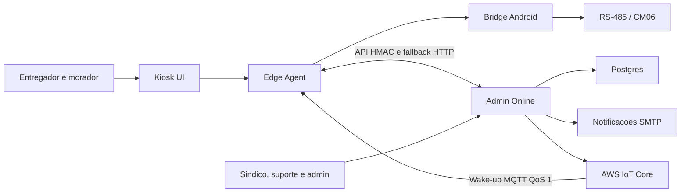

# Central de documentacao PREDDITA Locker

Esta e a pagina inicial da documentacao tecnica do projeto. O GitHub a exibe
automaticamente quando a pasta `docs/` e aberta.

Use esta central para localizar a fonte correta antes de alterar codigo,
instalar um locker, operar o Admin Online ou publicar uma nova versao.

> Ultima consolidacao: 21 de julho de 2026. Consulte
> [Atualizacoes da documentacao](UPDATES.md) para acompanhar o que mudou.

## Estado atual

| Item | Valor |
| --- | --- |
| Produto | PREDDITA Entregas Locker |
| Versao do produto | `2.0.31-lab` |
| Android `versionCode` | `31` |
| API `schemaVersion` | `13` |
| Pacote Android | `com.preddita.entregaslocker` |
| Hardware validado | KS1062-N-ZY, RK3562, Android 11/13 |
| Serial prioritaria | `/dev/ttyS5` |
| Frontend | React 18, Vite 8, Node.js 20.19+ |
| Backend | Node.js, armazenamento JSON para laboratorio ou Postgres 16 |
| Status | Kiosk V4 com jornadas, audio, console, serial resiliente e health check de update integrados em laboratorio, aguardando bancada e piloto controlado |

O estado acima descreve a base funcional. Mudancas apenas documentais feitas
depois da tag permanecem registradas em [UPDATES.md](UPDATES.md).

## O que compoe o projeto



- `web/`: interface publica, regras de entrega e Edge Agent.
- `android/`: WebView, RS-485, Android Keystore e atualizador do APK.
- `admin-online/`: API, painel administrativo, autenticacao, dados e operacao.
- `scripts/`: verificacoes, smokes, contratos, deploy e diagnostico.
- `.github/workflows/`: CI e publicacao de APK assinado.
- `docs/`: fontes tecnicas e historicas listadas nesta pagina.

## Por onde comecar

### Novo desenvolvedor

1. Leia o [historico completo](HISTORICO-COMPLETO-DE-MELHORIAS.md).
2. Entenda a [arquitetura tecnica](ARCHITECTURE.md).
3. Prepare o ambiente pelo [runbook de desenvolvimento](DEVELOPER-RUNBOOK.md).
4. Execute os testes antes de alterar os fluxos de porta.

### Instalacao e suporte de campo

1. Use o [guia de implantacao](../README.md).
2. Confirme hardware, serial e acesso ADB.
3. Execute o comissionamento fisico de todos os canais.
4. Nao considere uma operacao concluida sem prova fechada-aberta-fechada.

### Administracao e operacao cloud

1. Consulte a secao Admin Online da [arquitetura](ARCHITECTURE.md).
2. Configure autenticacao, banco, SMTP e origem HTTPS pelos exemplos `.env`.
3. Consulte [autenticacao do dispositivo](DEVICE-AUTH.md) antes de provisionar.
4. Valide [privacidade e retencao](PRIVACY-DATA-LIFECYCLE.md) antes do piloto.

### Release Android

1. Consulte [CI e release](CI-RELEASE.md).
2. Use keystore de release externo e secrets do GitHub.
3. Aumente `versionCode`; update remoto nao aceita downgrade.
4. Confira APK, certificado e checksum do GitHub Release.

## Catalogo da documentacao

| Documento | Conteudo | Atualizar quando |
| --- | --- | --- |
| [Historico completo](HISTORICO-COMPLETO-DE-MELHORIAS.md) | Evolucao, motivos, impactos, validacoes e limites | Uma etapa tecnica relevante for concluida |
| [Atualizacoes](UPDATES.md) | Registro cronologico de toda mudanca documental | Qualquer documento for criado ou alterado |
| [Arquitetura](ARCHITECTURE.md) | Componentes, fronteiras, fluxos, dados e estados | Contrato, componente ou fluxo mudar |
| [Runbook](DEVELOPER-RUNBOOK.md) | Setup, comandos, testes, troubleshooting e checklist | Ferramenta, comando ou procedimento mudar |
| [CI e release](CI-RELEASE.md) | Workflows, assinatura e artefatos | Pipeline, secret ou canal de release mudar |
| [Autenticacao do dispositivo](DEVICE-AUTH.md) | HMAC, nonce, Keystore e migracao | Assinatura ou provisionamento mudar |
| [Contratos e E2E](API-CONTRACTS-E2E.md) | Cobertura real de API e jornada Playwright | Payload ou jornada publica mudar |
| [Privacidade](PRIVACY-DATA-LIFECYCLE.md) | Minimizacao, retencao e titular | Dados, prazo ou processo mudar |
| [Revisao e plano](REVISAO-PLANO-MELHORIA-2026-07-08.md) | Diagnostico inicial e execucao do plano | Somente para registrar fechamento do plano |
| [Direcao tecnica v2](V2-ROADMAP.md) | Visao de produto, mercado e proximos marcos | Prioridade ou direcao de produto mudar |
| [Comparativo de mercado](MARKET-COMPARISON.md) | Referencias competitivas | Nova pesquisa for realizada |
| [Analise do app recuperado](ANALISE-COMPARATIVA-VEXPRESS-PENDRIVE.md) | Arquitetura, riscos e ideias do material local de referencia | Nova evidencia estatica for confirmada ou uma ideia entrar no backlog |
| [Plano de melhorias e Kiosk V4](PLANO-IMPLEMENTACAO-MELHORIAS-REDESIGN-2026-07-20.md) | Oito partes para redesign, audio, diagnostico, serial, update e piloto | Uma parte iniciar, mudar de escopo ou ser concluida |
| [Baseline visual e funcional V3](KIOSK-V3-BASELINE.md) | Screenshots, metricas, matriz Playwright e rollback anteriores ao Kiosk V4 | A referencia visual mudar intencionalmente |
| [Fundacao visual do Kiosk V4](KIOSK-V4-FUNDACAO-VISUAL.md) | Tokens, home responsiva, prototipos, licencas e gate visual da Parte 3 | A linguagem visual ou uma referencia V4 mudar |
| [Jornadas publicas do Kiosk V4](KIOSK-V4-JORNADAS-PUBLICAS.md) | Fluxos reais, contratos fisicos, screenshots, metricas e testes da Parte 3 | Uma jornada publica, regra de porta ou referencia visual mudar |
| [Audio acessivel do Kiosk V4](KIOSK-V4-AUDIO-ACESSIVEL.md) | Politica sem PII, assets, controles, testes e evidencias da Parte 4 | Prompt, volume, reproducao ou politica de audio mudar |
| [Console tecnico do Kiosk V4](KIOSK-V4-CONSOLE-TECNICO.md) | Acesso, allowlist Android, abas, auditoria, testes e evidencias da Parte 5 | Credencial, bridge, diagnostico ou procedimento de campo mudar |
| [Resiliencia serial do Kiosk V4](KIOSK-V4-RESILIENCIA-SERIAL.md) | Fila nativa, correlacao, retry seguro, recuperacao, metricas e gate da Parte 6 | Protocolo, driver, politica de retry ou evidencia de bancada mudar |
| [Saude de update do Kiosk V4](KIOSK-V4-SAUDE-UPDATE.md) | Primeiro boot, backup tecnico, pausa automatica, recuperacao e gate da Parte 7 | Estado, prazo, rollout, recuperacao ou evidencia fisica mudar |
| [Piloto controlado do Kiosk V4](KIOSK-V4-PILOTO-CONTROLADO.md) | Metricas sanitizadas, preflight, matriz fisica, parada, recuperacao e decisoes da Parte 8 | Evidencia de campo, taxa, gate ou decisao de escopo mudar |
| [Redesign publico](PASSO-A-PASSO-REDESIGN-PUBLICO.md) | Orientacoes da interface do kiosk | Experiencia publica mudar |
| [Plano original do redesign](superpowers/plans/2026-07-09-public-kiosk-redesign.md) | Plano historico que orientou a implementacao publica | Nao usar como runbook atual; preservar como decisao historica |
| [Notas do KS1062](../NOTES-KS1062.md) | Pesquisa do hardware e protocolo da placa | Nova evidencia de campo ou manual for validada |
| [Admin Online local](../admin-online/README.md) | Setup, persistencia e recursos do servidor | Configuracao ou recurso administrativo mudar |
| [Admin Online em servidor](../admin-online/README-ONLINE.md) | Variaveis e implantacao cloud generica | Requisito de producao mudar |
| [Deploy AWS EC2](../admin-online/AWS-EC2-DEPLOY.md) | Referencia de infraestrutura EC2/Caddy | Arquitetura AWS ou custo aprovado mudar |
| [Agente de teste](../scripts/test-agent-README.md) | Testes seguros e mutacoes opcionais contra uma instancia | Contrato ou flag do agente mudar |

Os documentos marcados como historicos preservam contexto de decisao. Para
comandos atuais, prefira o runbook e o README principal.

## Fontes de verdade

Evite manter a mesma informacao tecnica em varios lugares sem indicar qual e a
fonte oficial.

| Informacao | Fonte principal |
| --- | --- |
| Versao Android | `android/app/build.gradle` |
| Versao web | `web/package.json` |
| Versao Admin Online e schema | `admin-online/server.mjs` |
| Dependencias | `web/package-lock.json` e `admin-online/package-lock.json` |
| Modelo Postgres | `admin-online/sql/postgres-schema.sql` e stores `.mjs` |
| Contratos HTTP | `admin-online/server.mjs` e `web/src/remoteBridge.js` |
| Contrato Edge | `web/src/edgeAgent.js` |
| Estados e seguranca de porta | `web/src/lockerWorkflow.js` e `web/src/doorSafety.js` |
| Hardware Android | classes Java em `android/app/src/main/java/` |
| Matriz executada pelo CI | `.github/workflows/ci.yml` |
| Politica de privacidade | `admin-online/privacyLifecycle.mjs` e documento de privacidade |

Quando uma tabela desta central divergir do codigo, o codigo e a fonte de
verdade operacional e a documentacao deve ser corrigida na mesma alteracao.

## Comandos essenciais

Instalacao das dependencias:

```bash
cd web && npm ci
cd ../admin-online && npm ci
```

Testes principais:

```bash
cd web
npm run test:workflow
npm run build
npm run test:e2e

cd ../admin-online
npm run smoke
npm run test:recovery
```

Verificacao consolidada no Windows/PowerShell:

```powershell
./scripts/v2-verify.ps1
```

Diagnostico de campo:

```bash
chmod +x scripts/deploy.sh
./scripts/deploy.sh diagnose
./scripts/deploy.sh test-serial
```

## Como atualizar a documentacao

Toda mudanca documental deve seguir este fluxo:

1. Altere a fonte especializada adequada.
2. Atualize esta central se titulo, finalidade, versao ou caminho mudou.
3. Adicione uma entrada no topo de [UPDATES.md](UPDATES.md).
4. Explique o que mudou, por que, impacto e como foi validado.
5. Atualize o historico completo quando a mudanca representar uma nova etapa
   tecnica do produto.
6. Confira links relativos e nao registre segredos, dados pessoais, IPs reais
   ou credenciais.
7. Marque o checklist de documentacao no pull request.

Validacao local:

```bash
node scripts/check-documentation.mjs
```

No CI, o mesmo script valida links locais e bloqueia um pull request que altere
Markdown ou exemplos `.env` sem atualizar `docs/UPDATES.md`.

Uma correcao pequena pode ser agrupada com outras do mesmo dia. Mudancas de
contrato, seguranca, dados, hardware ou operacao sempre precisam de entrada
propria.

## Limites de seguranca

- Nao teste abertura de porta sem confirmar equipamento, canal e pessoas ao
  redor do locker.
- Nao coloque chave HMAC, senha, TOTP, cookie, keystore ou URL assinada em docs.
- Nao use leitura em bloco como prova de conclusao fisica.
- Nao trate MQTT como fonte de verdade.
- Nao instale APK sem validar pacote, versao, hash e certificado.
- Nao aplique eliminacao de titular enquanto existir entrega ativa.

## Proximos marcos

1. Piloto controlado com um locker comissionado.
2. Testes de falha de energia, rede, restart e restauracao.
3. Validacao operacional de SMTP, MQTT, logs e update remoto.
4. Aprovacao dos prazos e processos de privacidade.
5. Decisao de promocao do canal `lab` para piloto/producao.
