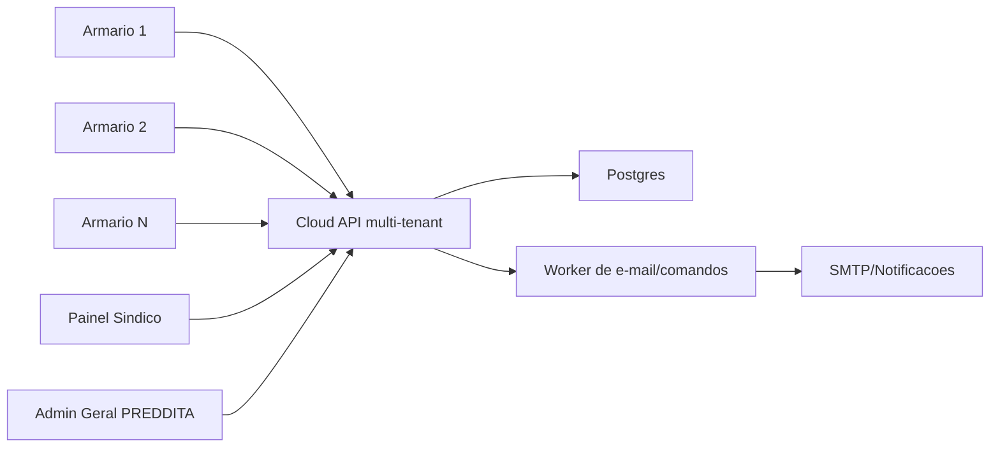

# PREDDITA Locker - revisao completa e plano de melhoria

Data da revisao: 2026-07-08

Este documento consolida a revisao tecnica da versao `preddita-entregas-retiradas-v2`.
O objetivo e separar riscos imediatos, evolucao para producao e novas
funcionalidades para escalar de um armario piloto para uma rede de armarios.

## Escopo revisado

- App do armario em `web/`.
- Bridge Android/RS-485 em `android/`.
- Painel e API online em `admin-online/`.
- Scripts de deploy/teste em `scripts/`.
- Documentacao em `docs/`.
- Fluxos de entregador, busca de entrega, abertura remota, sincronizacao offline,
  envio de e-mail, seguranca, deploy Docker/EC2 e caminho para multi-armario.

## Agentes usados

- Agente App/Kiosk: revisou fluxo do armario, estado local, offline-first,
  UX touch e workflow de entrega/retirada.
- Agente Backend/Admin: revisou API online, comandos remotos, persistencia,
  e-mail, multi-locker e concorrencia.
- Agente Android/Hardware: revisou WebView, serial, RS-485, camera, boot/kiosk
  e build Android.
- Agente Seguranca/Deploy: revisou segredos, HTTP/HTTPS, CORS, Docker, auditoria,
  LGPD, dependencias e CI.

## Validacao executada nesta revisao

- `node scripts/v2-workflow-test.mjs`: passou.
- `node scripts/v2-qr-scanner-test.mjs`: passou.
- `node scripts/v2-smoke-test.mjs`: passou.
- `node --check admin-online/server.mjs`: passou.
- `node --check admin-online/public/app.js`: passou.
- `npm run build` em `web/`: passou.
- `npm audit --omit=dev` em `web/`: passou.
- `npm audit --omit=dev` em `admin-online/`: falhou por vulnerabilidade alta em
  `nodemailer <= 9.0.0`.

## Progresso iniciado em 2026-07-08

### Execucao retomada em 2026-07-15

- O codigo-fonte recuperado foi promovido para a raiz limpa do workspace; extracao bruta,
  dependencias, builds e dados sensiveis ficaram fora do Git.
- Os dois snapshots recuperados de `state.json` foram preservados em
  `recovery/` com hashes SHA-256 documentados.
- Leitura de estado passou a aceitar BOM UTF-8 e a falhar de forma fechada em
  JSON invalido, sem substituir o arquivo por dados de demonstracao.
- Foi criado teste de regressao que prova a preservacao byte a byte do estado
  com BOM e do arquivo truncado.
- O app deixou de embutir IP e chave local no bundle; builds de producao aceitam
  apenas endpoints HTTPS configurados explicitamente.
- O agente de teste deixou de apontar para o servidor antigo e agora exige URL;
  HTTP e aceito somente em loopback.
- A WebView passou a servir os assets por
  `https://appassets.androidplatform.net`, com acesso universal a `file://`
  desligado, CSP, navegacao restrita e cleartext somente no APK de debug.
- Frames enviados a RS-485 passaram a exigir cinco bytes hexadecimais e BCC
  valido antes da escrita nativa.
- O release Android deixou de usar assinatura de debug e agora exige keystore
  de producao por variaveis de ambiente.
- Dependencias de producao de `web` e `admin-online` foram auditadas sem
  vulnerabilidades conhecidas.

Validacao desta etapa:

- Workflow, QR scanner, recuperacao de estado e smoke do Admin Online passaram.
- Build Vite de producao passou e o bundle nao contem o endpoint ou a chave
  local antigos.
- Configuracao Gradle passou; a compilacao do APK aguarda a instalacao local do
  Android SDK 34.

### Segundo lote executado em 2026-07-15

- Comandos remotos passaram a usar lease e ACK obrigatorio antes da abertura:
  `pending -> leased -> executing -> completed/failed`.
- `executionId` tornou ACK e conclusao idempotentes; replay nao duplica entrega,
  liberacao de porta ou auditoria.
- O app passou a manter diario local da execucao antes do RS-485 e antes da rede.
  Reboot durante a abertura bloqueia reexecucao automatica e gera resultado
  fisico desconhecido para verificacao.
- O backend passou a serializar mutacoes de comandos por armario e a reentregar
  leases expirados sem perder o comando.
- A bridge Android passou a acumular chunks, validar BCC, separar frames colados
  e resincronizar depois de ruido serial.
- O JavaScript passou a correlacionar resposta por comando, placa e canal.
- Versoes atualizadas para app/backend `2.0.10-lab`, schema 7 e bridge 1.5.
- A fila offline monolitica foi substituida por diario v2 com um registro por
  evento, migracao segura da v1, isolamento de corrupcao e remocao apenas depois
  do aceite idempotente do servidor.

Validacao do segundo lote:

- Smoke cobriu perda da resposta do snapshot, lease antigo, ACK repetido,
  `executionId` conflitante e conclusao repetida.
- Testes Java cobriram fragmentacao, concatenacao, ruido, BCC invalido e frames
  variaveis `0x80`/`0x9E`.
- Workflow, QR, recuperacao, protocolo serial, diario remoto, smoke e build Vite
  passaram em conjunto.

### Autenticacao de dispositivo reforcada em 2026-07-15

- Chamadas `/api/device/*` passaram a usar HMAC-SHA256 sobre metodo, rota,
  `lockerId`, timestamp, nonce e hash do corpo.
- O servidor bloqueia corpo adulterado, assinatura vencida e reutilizacao de
  nonce. Em producao, autenticacao legada impede o startup.
- O modo `dual` ficou disponivel somente para migracao controlada em laboratorio;
  assinatura HMAC invalida nunca faz fallback para a chave estatica.
- O smoke test passou a exercer o contrato real usado pelo kiosk.
- App, backend e Android foram atualizados para `2.0.11-lab` (`versionCode 11`).

### Credencial movida para Android Keystore em 2026-07-15

- O APK deixou de receber chave de device no build e passou a ser generico.
- A chave HMAC e provisionada em dialogo Android nativo e importada como chave
  nao exportavel no Android Keystore.
- A WebView recebe apenas metadados nao sensiveis e assinaturas para rotas
  `/api/device/*`; chave legada em `localStorage` e removida no release.
- CI e Vite falham se `VITE_PREDDITA_DEVICE_KEY` for definida em build.
- Versao atualizada para `2.0.12-lab`, `versionCode 12` e bridge `1.6.0`.

### Autenticacao administrativa real em 2026-07-15

- Tokens administrativos foram removidos do navegador e substituidos por login
  com senha derivada por `scrypt` e cookie de sessao `HttpOnly`,
  `SameSite=Strict` e `Secure` em producao.
- Mutacoes passaram a exigir CSRF e registrar o username autenticado na
  auditoria, sem confiar em `requestedBy` enviado pelo cliente.
- Papeis `sindico`, `operador`, `suporte` e `super_admin` agora sao aplicados
  pelo backend para operacao, apartamentos, exportacao, seguranca e dados
  pessoais.
- Cada usuario possui escopo de `tenantId` e `lockerIds`; acesso cruzado e
  recusado antes da leitura do estado.
- Foi adicionado gerador de `passwordHash` por stdin, smoke de sessao/papeis e
  migracao do agente operacional para sessao administrativa e HMAC.
- Versao atualizada para `2.0.13-lab` e `versionCode 13`.

### Confirmacao fisica das portas em 2026-07-15

- Deposito e retirada passaram a exigir leituras individuais com BCC valido e
  a transicao completa fechada-aberta-fechada no mesmo canal.
- Leituras antigas, em bloco, ambiguas ou sem mudanca de byte bloqueiam a
  operacao; timeout de comando so e aceito se a leitura individual comprovar a
  abertura.
- Abertura remota deixou de marcar a entrega como coletada imediatamente. O app
  persiste `pickup_opened`, reconcilia o fechamento mesmo apos reinicio e so
  entao sincroniza `delivery-collected`.
- O backend recusa `releasedDoor` sem prova temporal de fechamento.
- As polaridades `zeroOpen` e `zeroClosed` ficaram explicitas por armario para
  resolver a divergencia entre o manual e a placa observada em campo.
- Versao atualizada para `2.0.14-lab` e `versionCode 14`.

### Assistente de comissionamento em 2026-07-15

- O modo tecnico ganhou fluxo guiado por canal, com leitura fechada inicial,
  deteccao de polaridade, configuracao do tempo de acionamento, abertura e prova
  final de fechamento.
- O mapa fisico agora aceita portas pequenas, medias e grandes e e usado pelo
  kiosk e pelo Admin Online, sem depender do perfil fixo de canais.
- A conclusao exige provas validas de todos os canais; mudar board, quantidade,
  polaridade, tempo ou tamanhos invalida o registro anterior.
- O status, data e tempo configurado passam a compor o heartbeat e a visao
  operacional remota.
- Versao atualizada para `2.0.15-lab` e `versionCode 15`.

### Autenticacao persistente no Postgres em 2026-07-15

- Usuarios administrativos sairam da dependencia exclusiva do ambiente e
  passaram a ser reconciliados em `preddita_admin_users` no primeiro boot.
- Sessoes usam tabela propria, com somente o SHA-256 do token persistido; o
  cookie bruto continua `HttpOnly`, `SameSite=Strict` e `Secure` em producao.
- Restart preserva sessoes validas. Logout grava revogacao duravel e o mesmo
  cookie continua recusado depois de um novo restart.
- O smoke Postgres passou a reiniciar o servidor tres vezes para cobrir
  restauracao, bootstrap pelo banco, logout e rotacao de senha.
- MFA permanece como proxima camada para `super_admin` e `suporte`.
- Versao atualizada para `2.0.16-lab` e `versionCode 16`.

### MFA de contas privilegiadas em 2026-07-15

- `super_admin` e `suporte` passaram a exigir TOTP antes da criacao da sessao.
- O primeiro login apresenta QR e chave manual; a confirmacao entrega dez
  codigos de recuperacao de uso unico.
- Segredos TOTP ficam cifrados com AES-256-GCM e chave externa de 32 bytes;
  desafios ficam somente como SHA-256 no Postgres, expiram em cinco minutos e
  aceitam no maximo cinco tentativas.
- A verificacao transacional persiste o ultimo passo TOTP aceito para impedir
  replay entre processos e remove atomicamente cada codigo de recuperacao usado.
- O smoke Postgres cobre cadastro, reinicio, TOTP, replay, recuperacao, reuso e
  rotacao de senha; a interface foi validada em desktop e 390 px.
- Versao atualizada para `2.0.17-lab` e `versionCode 17`.

### Dados operacionais normalizados em 2026-07-15

- Moradores, entregas, comandos e auditoria sairam do JSONB principal e passaram
  para tabelas com chave `tenant_id + locker_id + id` e indices por uso.
- Entregas e comandos preservam o payload completo, mas expõem status, porta,
  destinatario, execucao e datas em colunas pesquisaveis.
- O servidor grava snapshot principal e entidades na mesma transacao e hidrata o
  contrato existente da API sem exigir mudancas no painel ou no armario.
- Snapshots legados recebem backfill automatico no primeiro acesso e passam a
  registrar `operational_schema_version=1` sem duplicar as quatro colecoes.
- O smoke Postgres inspeciona as tabelas diretamente e cobre tambem a migracao
  de um locker legado criado com o schema anterior.
- Versao atualizada para `2.0.18-lab`, `schemaVersion 8` e `versionCode 18`.

### Comandos transacionais em 2026-07-15

- Escritas genericas do estado Postgres deixaram de substituir comandos lidos
  anteriormente; backfill e primeiro boot continuam sincronizando a origem.
- Criacao, lease, ACK, expiracao e conclusao usam bloqueios no banco, revisao por
  linha e ate tres tentativas para deadlock ou falha de serializacao.
- Indices unicos impedem mais de um comando ativo por porta e o reuso de
  `executionId` entre comandos do mesmo locker.
- Conclusao e seus efeitos em portas, entregas e auditoria ficam na mesma
  transacao; replay retorna sucesso sem repetir efeitos.
- O smoke Postgres sobe duas instancias concorrentes e exige apenas uma criacao,
  um lease, um ACK efetivo, uma conclusao efetiva e uma auditoria.
- Versao atualizada para `2.0.19-lab`, `schemaVersion 9` e `versionCode 19`.

Primeiro pacote de Fase 0 aplicado apos esta revisao:

- `admin-online`: `nodemailer` atualizado para versao sem vulnerabilidades no
  `npm audit`.
- `admin-online`: rate limit administrativo passou a rodar antes da validacao do
  token, cobrindo tentativas invalidas.
- `admin-online`: endpoints `/api/device/*` receberam bucket de rate limit
  dedicado.
- `admin-online`: `x-forwarded-for` so e usado quando
  `PREDDITA_TRUST_PROXY=true`.
- `admin-online`: em `NODE_ENV=production`, o servidor agora falha no startup se
  tokens/chave/origens obrigatorios nao estiverem configurados.
- `android`: WebView debugging agora segue o estado `debuggable` do APK, ficando
  desligado em release.
- `android`: navegacao da WebView foi restringida aos assets internos do app
  servidos por `https://appassets.androidplatform.net/assets/www/`.
- `web`: retirada por PIN/QR passou a marcar `pickup_opened` e so libera a
  ocupacao apos o usuario tocar em finalizar/confirmar retirada.
- `web`: deposito em porta grande deixou de confirmar automaticamente depois de
  60 segundos; agora apenas exibe aviso para o entregador confirmar manualmente.
- `web`: selecao de porta evita portas com sensor fisico em estado `open` quando
  existe leitura recente da placa.
- `scripts`: teste de workflow passou a cobrir retirada aberta pendente e
  conclusao final.

Validacao apos o pacote:

- `powershell -ExecutionPolicy Bypass -File .\scripts\v2-verify.ps1`: passou.
- `android/gradlew.bat assembleDebug`: passou.

Segundo pacote aplicado:

- `admin-online`: suporte a `PREDDITA_DEVICE_KEYS` para chave por armario,
  mantendo `PREDDITA_DEVICE_KEY` como compatibilidade com o piloto atual.
- `admin-online`: chamadas `/api/device/*` agora validam `x-locker-id` e
  rejeitam payload de outro locker.
- `admin-online`: `GET /api/device/snapshot` passou a retornar `lockerId`.
- `admin-online`: criado `notificationOutbox` persistido no `state.json` para
  e-mails de PIN/QR.
- `admin-online`: eventos offline `delivery-stored` agora enfileiram e-mail e
  respondem rapidamente ao armario, sem depender do SMTP no mesmo request.
- `admin-online`: worker periodico processa o outbox e reenvia com backoff.
- `admin-online`: runtime do painel passou a expor contadores de notificacoes
  pendentes/falhas.
- `web`: remote bridge passou a enviar `x-locker-id` em todas as chamadas.
- `scripts`: smoke test passou a validar `PREDDITA_DEVICE_KEYS`, locker errado
  recusado, snapshot com `lockerId` e outbox criado por evento offline.
- `.env.example` e `.env.production.example`: adicionadas variaveis de chaves
  por locker, rate limit de device, outbox e proxy.

Validacao apos o segundo pacote:

- `powershell -ExecutionPolicy Bypass -File .\scripts\v2-verify.ps1`: passou.
- `android/gradlew.bat assembleDebug`: passou.

Terceiro pacote aplicado:

- `admin-online`: adicionada dependencia `pg`.
- `admin-online`: criado modo `PREDDITA_STORAGE=postgres`.
- `admin-online`: criado schema automatico `preddita_locker_states` com chave
  primaria `tenant_id + locker_id`.
- `admin-online`: `state.json` continua como fallback/laboratorio em
  `PREDDITA_STORAGE=json`.
- `admin-online`: no primeiro boot em Postgres, se existir `state.json` para o
  locker padrao, ele pode ser usado como snapshot inicial.
- `admin-online`: `readState/writeState` passaram a operar por `lockerId`, com
  suporte a `?lockerId=` no painel/API.
- `admin-online`: adicionado schema de referencia em
  `admin-online/sql/postgres-schema.sql`.
- `admin-online`: `docker-compose.prod.yml` passou a incluir Postgres interno.
- `scripts`: adicionado `v2-postgres-smoke-test.mjs`, executado pelo
  `v2-verify.ps1` quando houver `PREDDITA_TEST_DATABASE_URL`.
- Documentacao e `.env` atualizados para `PREDDITA_STORAGE`,
  `PREDDITA_DATABASE_URL`, `PREDDITA_TENANT_ID` e Postgres.

Validacao apos o terceiro pacote:

- Modo JSON/local: smoke e auditoria passaram.
- Smoke Postgres: criado e pronto para uso, mas nao executado nesta maquina
  porque Docker/Postgres nao estao instalados localmente.

## Diagnostico executivo

A versao atual esta boa para laboratorio/piloto: abre portas, opera localmente,
tem painel online, sync basico e testes de regra de negocio. Para producao e
para 30 armarios, ainda falta endurecer quatro pilares:

- Confiabilidade fisica: nenhuma entrega/retirada deve ser marcada como concluida
  sem confirmacao fisica ou confirmacao manual explicita e auditada.
- Offline-first real: todo evento importante precisa ser gravado localmente em
  diario duravel antes de tentar internet, e reenviado com idempotencia.
- Seguranca de producao: remover segredos expostos, trocar chaves globais por
  credenciais por armario, forcar HTTPS, restringir WebView e melhorar auth.
- Multi-armario: abandonar o modelo de um estado global em `state.json` e criar
  uma API multi-tenant com `locker_id`, usuarios, papeis e banco transacional.

## Achados prioritarios

### P0 - Corrigir antes de expandir

1. Segredos estao expostos no workspace.
   Ha arquivos e historicos com tokens/chaves reais. Devem ser considerados
   comprometidos. Proximo passo: revogar senha de app SMTP, rotacionar tokens de
   admin/super-admin/device e gerar novo APK.

2. `deviceKey` e global, estatico e embutido no app.
   O app usa chave de device no build/localStorage e ainda aceita HTTP em alguns
   fluxos. Quem extrair ou interceptar essa chave pode se passar pelo armario.
   Proximo passo: chave por armario, HMAC com timestamp e HTTPS obrigatorio.

3. WebView Android expoe a bridge de portas em superficie sensivel.
   `addJavascriptInterface`, debug de WebView em release, `usesCleartextTraffic`
   e acesso universal de arquivos aumentam muito o risco. Proximo passo:
   permitir somente `file:///android_asset/www/`, desativar debug em release,
   remover universal access quando possivel e usar Network Security Config.

### P1 - Corrigir para confiabilidade operacional

1. Retirada pode ser marcada como concluida cedo demais.
   O fluxo atual abre a porta e libera a ocupacao logo depois, mesmo se a
   confirmacao fisica falhar ou der timeout. Proximo passo: criar estado
   `retirada_aberta`, guardar `activePickup`, e liberar somente apos sensor
   fechado ou botao final explicito.

2. Deposito em porta grande pode auto-confirmar.
   O app tem retorno automatico que chama confirmacao apos tempo. Isso pode gerar
   PIN/e-mail para entrega nao depositada. Proximo passo: timeout deve voltar ao
   inicio/cancelar ou pedir acao, nunca confirmar sozinho.

3. Escolha de porta olha ocupacao logica, mas nao garante sensor fechado.
   Uma porta livre no estado pode estar fisicamente aberta ou sem leitura recente.
   Proximo passo: `findAvailableDoor` deve considerar ocupacao, sensor fechado e
   leitura recente antes de reservar.

4. Servidor ainda nao e multi-armario de verdade.
   `lockerId` e enviado pelo app, mas a API trabalha com um estado global. Em 30
   armarios, um device pode receber dados/comandos de outro. Proximo passo:
   modelar `tenants`, `lockers`, `doors`, `residents`, `deliveries`, `commands`
   e `events` com `locker_id`.

5. Comando remoto pode ser perdido. **Resolvido no segundo lote de 2026-07-15.**
   A entrega passou a usar lease/ACK e `executionId`. Resposta perdida reabre a
   fila, enquanto o diario local impede reexecucao fisica duplicada.

6. Eventos/e-mails podem duplicar ou se perder em concorrencia.
   O servidor le estado, envia SMTP e so depois grava. Requisicoes concorrentes
   podem duplicar envio ou sobrescrever estado. Proximo passo: usar outbox de
   notificacao e gravar transacao antes de disparar e-mail.

7. RS-485 precisa tratar frames, nao chunks. **Resolvido no segundo lote de 2026-07-15.**
   O Android agora usa buffer nativo, tamanho/BCC e resincronizacao. O JavaScript
   correlaciona comando, placa e canal antes de confirmar a resposta.

8. Semantica de sensor precisa ser validada e documentada.
   Codigo e docs divergem entre `0x00`/`0x11` para aberta/fechada. Proximo passo:
   teste de bancada porta aberta/fechada, alinhar codigo, docs e testes.

9. Dependencia vulneravel no Admin Online.
   `nodemailer <= 9.0.0` esta vulneravel. Proximo passo: atualizar dependencia,
   rodar smoke test e validar SMTP.

### P2 - Melhorias estruturais

1. Persistencia em `state.json` e fragil para producao.
   Corrupcao pode recriar estado; auditoria fica no mesmo arquivo. Proximo passo:
   migrar para Postgres ou, no minimo, JSONL append-only com backups e checksum.

2. Dados pessoais e PIN/QR ficam em claro.
   Precisa politica LGPD: minimizacao, retencao, mascaramento em exportacoes,
   criptografia em repouso e expiracao de entregas/codigos.

3. Docker/EC2 ainda e simples demais para producao.
   Container roda como root e ha compose HTTP direto. Proximo passo: usuario
   nao-root, HTTPS via Caddy/Nginx, healthcheck, volumes, backup, logs e restart.

4. CI ainda nao existe.
   Os scripts manuais sao bons, mas devem rodar em pipeline. Proximo passo:
   GitHub Actions ou pipeline equivalente com testes, build, audit e lint Android.

5. `App.jsx` concentra responsabilidade demais.
   O arquivo tem UI, hardware, sync, estado, regras e remote bridge misturados.
   Proximo passo: extrair hooks/modulos: `useLockerStore`, `useHardwareStatus`,
   `useRemoteBridgeLoop`, `useCourierFlow`, `usePickupFlow`.

## Arquitetura recomendada para 30 armarios

Nao recomendo uma EC2/Docker por armario como arquitetura final. Isso aumenta
custo, manutencao, deploy, backup, observabilidade e seguranca. O melhor caminho:

Modelo recomendado:

- Um backend online multi-tenant.
- Cada armario e um `locker` com `locker_id`, chave propria e configuracao de
  portas.
- Cada predio/cliente e um `tenant`.
- Painel do sindico ve apenas o proprio predio.
- Admin Geral PREDDITA ve todos os predios, saude dos devices, auditoria e filas.
- Armario continua offline-first e sincroniza quando a internet voltar.

## Roadmap sugerido

### Fase 0 - Seguranca e estabilizacao do piloto

Prazo sugerido: 1 semana.

- Rotacionar todos os segredos expostos.
- Atualizar `nodemailer` e revalidar envio de e-mail.
- Forcar HTTPS no Admin Online.
- Definir `PREDDITA_ALLOWED_ORIGINS`.
- Desativar debug WebView em release.
- Bloquear WebView para carregar somente assets locais.
- Remover auto-confirmacao de deposito.
- Corrigir retirada para liberar porta somente apos confirmacao.
- Validar e documentar semantica real dos sensores.

### Fase 1 - Offline-first confiavel

Prazo sugerido: 2 a 3 semanas.

- [Concluido] Criar diario local isolado por evento no armario para eventos
  criticos, com replay idempotente e migracao da fila v1.
- Persistir evento antes de abrir porta sempre que possivel.
- Implementar fila de sync idempotente com `event_id`.
- Manter outbox local para e-mails pendentes quando offline.
- Implementar `last-known-good` para moradores e configuracao.
- Garantir que reboots nao percam confirmacoes pendentes.
- Criar testes de falha: sem internet, reboot durante porta aberta, SMTP fora,
  servidor fora, duplicidade de evento.

### Fase 2 - Backend multi-armario

Prazo sugerido: 3 a 6 semanas.

- Migrar de `state.json` para Postgres.
- Criar schema com `tenant_id` e `locker_id`.
- Separar credenciais por armario.
- Criar roles: Sindico, Operador, Admin Geral, Suporte Tecnico.
- Criar painel Admin Geral para todos os armarios.
- Criar painel Sindico limitado ao predio.
- Criar fila de comandos com lease/ack/idempotencia.
- Criar notification outbox com retry e historico.

### Fase 3 - Hardware e kiosk robusto

Prazo sugerido: 2 a 4 semanas em paralelo.

- Implementar parser de frames RS-485 no Android.
- Correlacionar respostas por board/canal/comando.
- Criar tela local de diagnostico tecnico protegida.
- Validar em campo o assistente de comissionamento em cada modelo de placa e
  documentar eventuais diferencas de firmware e porta serial.
- Habilitar boot/kiosk de forma controlada: BootReceiver, Device Owner/Lock Task
  ou launcher dedicado, conforme politica do equipamento.
- Melhorar camera: permissao pre-concedida no deploy, reabrir scanner apos grant,
  fallback por PIN sempre visivel.

### Fase 4 - Produto e escala

Prazo sugerido: continuo.

- Notificacoes por e-mail, SMS e WhatsApp.
- QR/PIN com expiracao e tentativa limitada.
- Foto/prova de deposito pela camera.
- Alertas de porta aberta por tempo demais.
- Dashboard de saude por armario: online/offline, serial, ultima leitura,
  comandos pendentes, e-mails pendentes, versao APK.
- Atualizacao remota de app com rollout e rollback.
- Exportacao de auditoria para sindico.
- Webhooks/API para condominios, transportadoras ou ERPs.

## Backlog priorizado

| Prioridade | Item | Impacto | Esforco |
| --- | --- | --- | --- |
| P0 | Rotacionar segredos e rebuildar APK | Muito alto | Medio |
| P0 | Forcar HTTPS e restringir CORS | Muito alto | Medio |
| P0 | Desativar WebView debug/restringir navegacao | Muito alto | Medio |
| P1 | Corrigir retirada para confirmar fisicamente | Muito alto | Medio |
| P1 | Remover auto-confirmacao de deposito | Alto | Baixo |
| P1 | Atualizar `nodemailer` | Alto | Baixo |
| P1 | Porta disponivel = livre + sensor fechado + leitura recente | Alto | Medio |
| P1 | Fila local duravel de eventos | Muito alto | Alto |
| P1 | Outbox de e-mail no servidor | Muito alto | Medio |
| P1 | Comandos remotos com lease/ack | Alto | Medio |
| P1 | Parser RS-485 por frame | Alto | Medio |
| P2 | Postgres multi-locker | Muito alto | Alto |
| P2 | Painel Admin Geral + Sindico por papel | Alto | Alto |
| P2 | CI com testes/build/audit | Alto | Medio |
| P2 | LGPD/retencao/mascaramento | Alto | Medio |

## Novas funcionalidades recomendadas

- Cadastro de predios/armarios no Admin Geral.
- Vinculo de apartamentos por predio, sem depender de nome/CPF no kiosk.
- Provisionamento de armario com QR/chave inicial.
- Mapa visual de portas por tamanho e estado fisico.
- Historico por entrega: criada, porta aberta, depositada, e-mail enviado,
  retirada, falha, suporte.
- Reenvio manual de notificacao pelo sindico.
- Modo tecnico com teste de porta individual e relatorio exportavel.
- Alertas automaticos: armario offline, serial fechada, fila parada, porta aberta,
  SMTP falhando, reboot frequente.
- QR scanner com camera integrada e fallback por PIN.
- Comprovante de entrega por foto opcional.

## Criterio de pronto para producao

Antes de instalar em varios predios, o sistema deve cumprir:

- Nenhum segredo real versionado ou embutido globalmente.
- HTTPS obrigatorio.
- Chave unica por armario.
- Painel com login/roles reais.
- Eventos offline reenviados apos reboot.
- E-mail enviado por outbox com retry e auditoria.
- Abertura/retirada dependente de confirmacao fisica ou confirmacao manual
  auditada.
- Banco transacional com backup.
- Testes automatizados rodando em CI.
- Checklist de instalacao em campo: energia, RS-485, sensores, camera, rede,
  boot/kiosk, teste de porta pequena e grande.

## Proximo passo recomendado

Comecar pela Fase 0. A ordem ideal e:

1. Rotacionar segredos e atualizar dependencias.
2. Fechar riscos de WebView/HTTP.
3. Corrigir os fluxos de confirmacao de deposito/retirada.
4. Validar sensor em bancada e alinhar docs/codigo.
5. So depois iniciar Postgres/multi-armario.

Essa ordem reduz risco operacional imediatamente e evita construir a plataforma
multi-armario em cima de premissas frageis de seguranca e confirmacao fisica.
